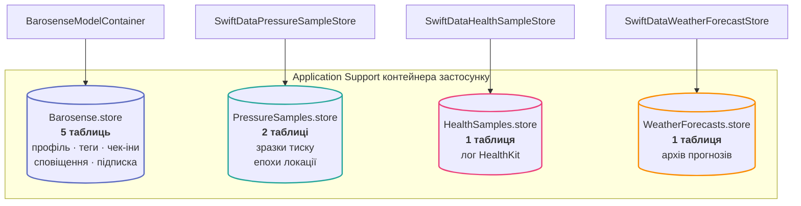
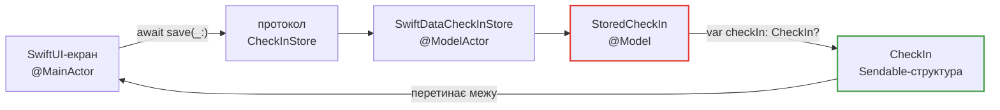

# База даних

Barosense не має бекенду. Уся база — це кілька файлів SQLite у контейнері застосунку,
відкритих через **SwiftData**.

!!! abstract "Схема генерується з коду"
    Окремого файлу моделі даних (`.xcdatamodeld`) у SwiftData немає — схемою **є** самі
    `@Model`-класи. Тому [схема таблиць](../generated/database-schema.md) на цьому сайті
    витягується з коду під час збірки і не може розійтися з тим, що відкриє застосунок.

## Чотири окремі бази, а не одна



Чому не одна база:

| Файл | Що в ньому | Чому окремо |
| --- | --- | --- |
| `Barosense.store` | Профіль, словник тегів, чек-іни, журнал сповіщень, підписка | Це один граф: чек-ін посилається на теги, нагадування планується від таблиці чек-інів. Розділити — означає відкривати їх окремо і розходитися в тому, які теги існують |
| `PressureSamples.store` | Зразки барометра + епохи локації | Сенсорний лог: сотні тисяч рядків, свій ритм запису, своя політика зберігання. У графі профілю йому нічого робити |
| `HealthSamples.store` | Лог HealthKit | Те саме, плюс окремий шлях запису через observer-запити |
| `WeatherForecasts.store` | Архів кривих WeatherKit | Це погодні дані, а не персональні. Схема `BarosenseModelContainer` — свідомий перелік того, що належить до графа профілю |

`StoredSubscription` живе в `Barosense.store` **не** тому, що на щось там посилається. Він
там тому, що окремий контейнер був би четвертим файлом SQLite, який може не відкритися на
запуску, — а його невдача заблокує платного користувача поза тим, що він купив.

## CloudKit вимкнено свідомо

```swift title="Shared/Persistence/SwiftData/BarosenseModelContainer.swift"
let configuration = ModelConfiguration(
    schema: schema,
    url: try storeURL(fileName: storeFileName),
    cloudKitDatabase: .none          // ← не дефолт, а обмеження №2 з CLAUDE.md у коді
)
```

Чек-іни, словник тегів і профіль — це дані про здоров'я або суміжні з ним. Синхронізація
будь-чого з цього вимагає **окремої явної згоди** плюс ADR, якого поки немає. Увімкнути
CloudKit — це рішення з гейтом, а не правка конфігурації.

## Ізоляція: `@ModelActor` навколо кожного сховища

Ні `ModelContext`, ні жоден `@Model`-інстанс **ніколи не перетинають межу ізоляції**.
Кожне сховище — це `@ModelActor`, який назовні віддає типи-значення з `Shared/Models/`.



Червоне ніколи не виходить за межі актора. Зелене — єдине, що перетинає.

## Протокол → реалізація → дублер

Кожна таблиця має три шари, і це не церемонія: **ML-конвеєр повинен запускатися з
простого юніт-тесту**, а SwiftData туди не дотягнеш.

| Протокол | Durable-реалізація | Дублер для тестів |
| --- | --- | --- |
| [`CheckInStore`](../reference/Shared/Persistence/CheckInStore.md) | `SwiftDataCheckInStore` | `InMemoryCheckInStore` |
| [`PressureSampleStore`](../reference/Shared/Persistence/PressureSampleStore.md) | `SwiftDataPressureSampleStore` | `InMemoryPressureSampleStore` |
| [`HealthSampleStore`](../reference/Shared/Persistence/HealthSampleStore.md) | `SwiftDataHealthSampleStore` | `InMemoryHealthSampleStore` |
| [`UserProfileStore`](../reference/Shared/Persistence/UserProfileStore.md) | `SwiftDataUserProfileStore` | `InMemoryUserProfileStore` |
| [`WellbeingTagStore`](../reference/Shared/Persistence/WellbeingTagStore.md) | `SwiftDataWellbeingTagStore` | `InMemoryWellbeingTagStore` |
| [`WeatherForecastStore`](../reference/Shared/Persistence/WeatherForecastStore.md) | `SwiftDataWeatherForecastStore` | in-memory режим того самого класу |
| [`PressureLocationEpochStore`](../reference/Shared/Persistence/PressureLocationEpochStore.md) | `SwiftDataPressureLocationEpochStore` | in-memory режим того самого класу |
| [`NotificationStore`](../reference/Shared/Notifications/NotificationStore.md) | `SwiftDataNotificationStore` | in-memory режим того самого класу |

Єдине місце, яке знає, яка реалізація справжня, —
[`AppServices`](../reference/Barosense/AppComposition.md).

## Зв'язки підтримує код, а не `@Relationship`

У проєкті **жодне поле не оголошене як `@Relationship`**. Рядки пов'язані значенням ключа:

- `PersistedPressureSample.locationEpochID` → `PersistedPressureLocationEpoch.id`
- `StoredCheckIn.tagIdentityKeys` → `StoredWellbeingTag.identityKey`

Обидві пари лежать **в одному контейнері** — тобто справа не в тому, що
`@Relationship` між контейнерами неможливий (хоч це й правда). Причини конкретні й різні:

- **`locationEpochID`** — зв'язок поклав би правила каскаду епохи та вартість її вибірки
  на **гарячий шлях запису** таблиці, яка отримує рядок кожні п'ятнадцять хвилин, заради
  join'у, який калібратор робить раз на прохід.
- **`tagIdentityKeys`** — ключі зберігаються рядками, а не доменним типом
  `WellbeingTag.ID`, щоб доменний тип був вільний змінювати форму. Збережений блоб, який
  декодувався б прямо в нього, робив би кожну таку зміну міграцією, якої ніхто не помітив
  би, що пише.

Наслідок, який треба тримати в голові: **цілісність не забезпечується базою**, її
забезпечує код сховища й тести на нього.

## Що далі

- [Схема таблиць](../generated/database-schema.md) — ER-діаграма і колонки, згенеровані з коду
- [Життєвий цикл даних](lifecycle.md) — скільки що зберігається і як видаляється
