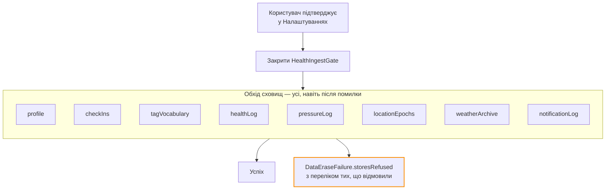

# Життєвий цикл даних

Скільки що живе, хто це видаляє і що робить «видалити мої дані».

## Політики зберігання

| Таблиця | Горизонт | Хто прибирає | Обґрунтування |
| --- | --- | --- | --- |
| `PersistedPressureSample` | **5 років** | `PressureRetentionPolicy`, перевірка раз на добу після вдалого зчитування | П'ять проходів річного циклу; на 1 рядок/15 хв це ~175 000 рядків, десятки МБ з індексом |
| `PersistedPressureLocationEpoch` | ті самі 5 років | разом із логом тиску | Епоха має пережити зразки, які на неї посилаються |
| `PersistedWeatherForecastPoint` | **90 днів** сирих рядків | `WeatherForecastPolicy.rawCutoff` | Достатньо, щоб виміряти реалізований скіл і перерахувати калібрування зсуву за сезон. Похідні ознаки з цих рядків зберігаються безстроково — це чотири float на добу |
| `PersistedHealthSample` | **без автоматичного горизонту** | лише `BarosenseDataEraser` | `deleteSamples(before:)` існує, але планового виклику немає. Це свідомо: рядки з HealthKit — це розмітка контексту, а не сенсорний потік із частотою барометра |
| `StoredCheckIn` | **безстроково** | лише користувач або erase | Це і є та історія, заради якої існує застосунок |
| `StoredNotification` | **безстроково** | лише erase | Журнал відправленого, з якого рахується денний бюджет |
| `StoredUserProfile`, `StoredWellbeingTag`, `StoredSubscription` | **безстроково** | лише erase | Стан, а не потік |

!!! note "Прибирання не має власного таймера"
    Жодна політика зберігання не заводить `BGTask` чи таймер. Перевірка горизонту
    відбувається **всередині роботи, яку застосунок і так робив** — після вдалого
    зчитування тиску, не частіше ніж раз на добу (`pruneIntervalSeconds`). Це вимога
    бюджету батареї: новий засіб пробудження треба обґрунтовувати, а прибирання на це
    не заслуговує.

## Обсяг на горизонті

| Таблиця | Рядків на горизонті | Звідки число |
| --- | --- | --- |
| `PersistedPressureSample` | ~175 000 | 1 рядок / 15 хв × 5 років |
| `PersistedWeatherForecastPoint` | ~86 000 | 4 запити/добу × ~240 погодинних точок × 90 днів |
| `StoredCheckIn` | одиниці на добу | Обмежене тим, скільки людина реально вводить |

## «Видалити мої дані»

[`BarosenseDataEraser`](../reference/Shared/Persistence/BarosenseDataEraser.md) обходить
**вісім** сховищ у трьох контейнерах.

**Не транзакційно, і не може бути.** Три контейнери — це три окремі збереження; збій між
ними лишає пристрій частково очищеним. Тому:

1. Кожне сховище пробується **навіть після того, як попереднє відмовило** — зупинка на
   першій помилці змусила б користувача вважати, що видалено більше, ніж насправді.
2. Помилка називає, що саме **вціліло**, а не «щось пішло не так».

### Чого erase свідомо не чіпає

| Що | Чому |
| --- | --- |
| `UserDefaults` | Там лежить лише вибір мови інтерфейсу. Нічого персонального; очищення перемкнуло б мову посеред флоу без жодного виграшу для приватності |
| Дозвіл на локацію | Відкликати його — дія користувача в Налаштуваннях. Erase прибирає **координати та назви місць**, які зберіг Barosense |
| Самі дані HealthKit | Ці рядки належать застосунку «Здоров'я», їх лише читали, і видаляти їх — не наше право |

### Гейт інжесту

Erase закриває [`HealthIngestGate`](../reference/Shared/Health/HealthIngestGate.md). Без
цього наступне спрацювання `HKObserverQuery` (або перша активація сцени) поклало б той
самий тиждень читань назад — алерт обіцяв, що даних немає, а через хвилини вони були.

Гейт **закритий при створенні** і відкривається, коли онбординг позаду. Оскільки цей факт
живе у профілі на диску, призупинення переживає перезапуск.

## Міграції

Схема еволюціонує додаванням опціональних полів. Приклад із коду: `StoredSubscription`
приєднався до наявного контейнера як полегшена міграція — кожне поле опціональне, тож
наявна інсталяція отримує порожню таблицю, а не потребу в маппінгу.

Два правила, які видно в коментарях коду:

1. **Ім'я файлу сховища — частина контракту.** Перейменувати `Barosense.store` означає
   осиротити історію кожної наявної інсталяції.
2. **Сирі значення `rawValue` персистяться.** Їх не перенумеровують. Рядок, записаний
   збіркою, що знала іншу шкалу, має **відкидатися** діапазонною перевіркою, а не
   зачитуватися як власна протилежність — саме тому `scoreRawValue` перейменували на
   `intensityRawValue`, коли шкала 1–5 стала 1–10.

## Резервні копії

Файли лежать в `Application Support` контейнера застосунку, тож потрапляють у резервну
копію iCloud/iTunes разом із застосунком. Це **не** синхронізація: копія зашифрована
ключем пристрою/акаунта і не є мережевим вивантаженням даних про здоров'я в розумінні
обмеження №2.
