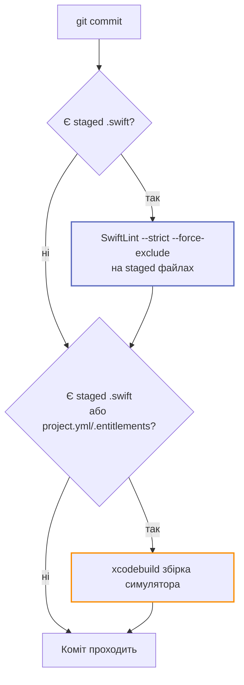

# Збірка й тести

## `.xcodeproj` генерується

Проєктний файл **не зберігається в репозиторії** — він генерується з `project.yml`. Це
прибирає merge-конфлікти у проєктному файлі, які інакше виникають у кожному другому PR.

```bash
brew install xcodegen      # одноразово
xcodegen generate          # створює Barosense.xcodeproj
```

| Дія | Потрібна регенерація? |
| --- | --- |
| Додати файл усередину наявної теки `sources` | **Ні** — XcodeGen глобить теки |
| Додати нову теку верхнього рівня | Так |
| Додати новий таргет | Так |
| Змінити `project.yml` або `.entitlements` | Так |

`project.yml` — **єдине джерело правди про таргети**. Що воно не розійшлося з тим, що є на
диску, перевіряє `scripts/ci/check-project-manifest.sh`.

## Збірка

```bash
xcodebuild -project Barosense.xcodeproj -scheme Barosense \
  -destination 'platform=iOS Simulator,name=iPhone 17' build
```

## Тести

```bash
xcodebuild -project Barosense.xcodeproj -scheme Barosense \
  -destination 'platform=iOS Simulator,name=iPhone 17' test
```

!!! warning "`name=` має збігатися зі встановленим симулятором"
    Інакше `xcodebuild` падає ще до компіляції. Перевірити:

    ```bash
    xcrun simctl list devices available
    ```

    Модель пристрою має значення лише тоді, коли зміна чутлива до розкладки.

### Або одна команда

```bash
scripts/ci/run-tests.sh
```

Це те саме, що виконує CI. Усе, специфічне для середовища (який Xcode, який симулятор),
резолвиться в рантаймі — оновлення образу раннера нічого не змінює в репозиторії, а
розбіжність падає зі списком того, що реально встановлено, замість криптичної помилки
`xcodebuild`.

Змінні:

| Змінна | Значення за замовчуванням |
| --- | --- |
| `DERIVED_DATA` | `.build/ci-dd` |
| `RESULT_BUNDLE` | `.build/TestResults.xcresult` |

## Guards без Xcode

```bash
scripts/ci/run-all.sh
```

П'ять перевірок, які виконуються за секунди на Linux — деталі в [CI та guards](ci.md).
Скрипт **не зупиняється на першій помилці**: він звітує про всі й повертає ненульовий код,
якщо хоч одна впала.

## Pre-commit hook

```bash
git config core.hooksPath .githooks
```

Активується один раз на клон. Що робить:



`--strict` означає, що **ворнінг теж блокує коміт**.

Аварійні виходи:

```bash
SKIP_BUILD=1 git commit -m "…"    # пропустити тільки збірку
git commit --no-verify -m "…"      # пропустити все
```

GUI-клієнти git (Xcode, Fork) стартують із мінімальним `PATH`, тому хук сам додає
`~/.local/bin`, `/opt/homebrew/bin` і `/usr/local/bin`.

## Що потрібно для повної збірки

| Фіча | Вимога |
| --- | --- |
| WeatherKit | Платний Apple Developer акаунт, App ID із capability, заповнений `DEVELOPMENT_TEAM` у `project.yml` |
| HealthKit | Те саме + entitlement |
| Барометр | **Фізичний iPhone.** У симуляторі `CMAltimeter.isRelativeAltitudeAvailable()` віддає `false` |
| App Intents | `AppIntents.framework` слінковано явно в `project.yml` — без цього `appintentsmetadataprocessor` мовчки пропускає екстракцію і Siri нічого не знає про шорткати |

## Локалізація

`SWIFT_EMIT_LOC_STRINGS: YES` змушує компілятор випускати `.stringsdata` для кожного
`LocalizedStringKey` і `String(localized:)`. Без цього новий ключ **мовчки** ніколи не
доїжджає до `Localizable.xcstrings` і відвантажується неперекладеним.

Мови: `en`, `uk`.

## Тема інтерфейсу

`INFOPLIST_KEY_UIUserInterfaceStyle: Light` — застосунок закріплений у світлій темі.

Причина в коментарі `project.yml`: у Figma є одна тепла світла тема, кожна поверхня в ній —
фіксований hex. Під темною системною темою інвертувалася б лише жменька системно
намальованих речей, і інвертувалися б вони **на** ці фіксовані світлі поверхні: prompt у
`TextField` став би майже білим на білому, а клавіатура і системні share-шити приїхали б
темними на їхньому тлі.

Закріплено тут, а не через `.preferredColorScheme` на кореневому в'ю, бо порушники —
UIKit-backed (`UIPickerView`, клавіатура), і це один вимикач, який читають вони всі.
Прибрати — того дня, коли Figma віддасть темну палітру, не раніше.
