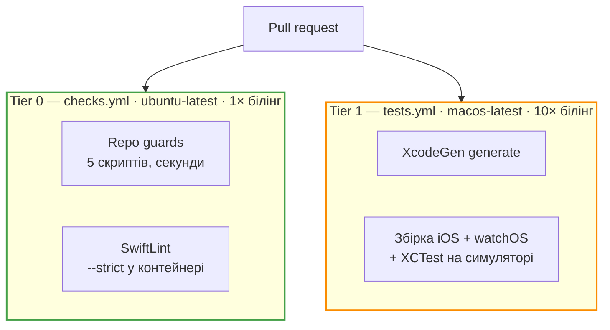

# CI та guards

## Дворівнева піраміда



Два workflow йдуть **паралельно**, а не послідовно: репозиторій публічний, тож
GitHub-hosted macOS-хвилини безкоштовні. На приватному репозиторії варто було б гейтувати
повільний на швидкому.

!!! note "Чому немає path-фільтра на tests.yml"
    Job, пропущений через `paths-ignore`, **ніколи не репортує статус** — і required check
    заблокував би кожен doc-only PR назавжди. Дешевше ганяти щоразу.

## П'ять guard-скриптів

```bash
scripts/ci/run-all.sh
```

| Скрипт | Що перевіряє | Яке обмеження стереже |
| --- | --- | --- |
| `check-copy-vocabulary.sh` | Заборонений словник у користувацьких рядках і копії | №1 — жодних медичних тверджень |
| `check-network-egress.sh` | Що єдиний вихідний трафік — WeatherKit | №2 — дані про здоров'я не залишають пристрій |
| `check-healthkit-sync.sh` | Що read-сет, entitlements і purpose strings узгоджені | №3 — точкові дозволи |
| `check-project-manifest.sh` | Що `project.yml` не розійшовся з тим, що на диску | XcodeGen як джерело правди |
| `check-ml-spec-drift.sh` | Що зміна ознак прийшла разом зі зміною `ml-spec.md` | ML-спека як джерело правди |

Скрипт **не зупиняється на першій помилці**: він проганяє всі й повертає ненульовий код,
якщо хоч одна впала. Це навмисно — виправляти краще все разом.

`check-ml-spec-drift.sh` потребує `BASE_REF` (у CI — sha бази PR) і повної історії, тому
в workflow стоїть `fetch-depth: 0`.

## Ті самі правила, що й у pre-commit — але без обходу

`checks.yml` дублює `.githooks/pre-commit` навмисно: хук можна обійти через `--no-verify`,
CI — ні. Щоб це щось означало, checks мають бути **required status checks на `main`**.

## Пінінг

Дві речі запіновані жорсткіше, ніж зазвичай, і причина в обох одна.

**Сторонні actions — по commit SHA, ніколи по тегу.**

```yaml
- uses: actions/checkout@3d3c42e5aac5ba805825da76410c181273ba90b1 # v7.0.1
```

Тег — це змінний вказівник, який власник action може пересунути будь-коли. Пінінг по тегу
означає, що компрометація апстріму або неанонсована ламка зміна приїжджає в CI цього
репозиторію **без жодного дифа**. Коментар `# vX.Y.Z` — для людини; Dependabot оновлює
обидва.

**SwiftLint — по digest, не лише по тегу.** Docker-тег так само змінний, як git-тег, тож
`:0.65.0` можна перепушити. Версія збігається з тією, яку розробники ганяють локально:
незапінований тег перетворює реліз SwiftLint на несподівано червону збірку в непричетному
PR.

## Раннер macOS

`runs-on: macos-latest`, а не конкретний лейбл образу. Причина прагматична: невідомий
лейбл лишає job у черзі **назавжди й без помилки**, тоді як застарий Xcode на
`macos-latest` падає всередині `run-tests.sh` менш ніж за хвилину — зі списком Xcode, які
реально встановлені.

Якщо таке станеться, лейбл піниться на образ, що везе Xcode 26+.

## Артефакти

Бандл із результатами вивантажується **тільки при падінні**. У ньому лог `xcodebuild` і
падіння XCTest із прогону на симуляторі над синтетичними фікстурами — жодних даних про
здоров'я, жодних чек-інів, нічого користувацького туди дійти не може.

## Слеш-команди

| Команда | Що робить |
| --- | --- |
| `/pr-prepare` | Аудит гілки, усі pre-PR гейти, чернетка тіла PR — і **зупинка** для схвалення людиною |
| `/release-check` | Прохід відповідності перед TestFlight: словник копії, синхронність HealthKit, сумарний бюджет батареї, мережевий егрес. Read-only, віддає go/no-go |
| `/ml-eval` | Регресія метрик: forward-chaining, precision/recall/PR-AUC проти базових ліній, таблиця для тіла PR |
