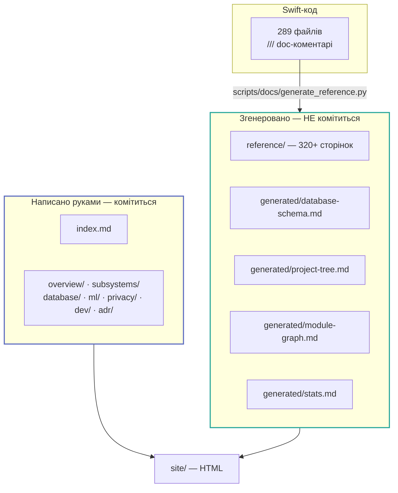
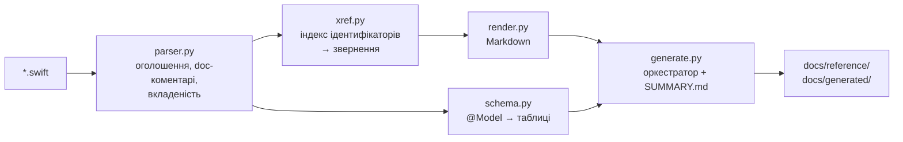
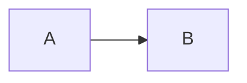

# Як влаштована ця документація

## Дві половини



**Правило:** якщо факт можна витягти з коду — його **не** пишуть руками. Список викликів,
схема бази, дерево тек і граф залежностей перебудовуються на кожній збірці й тому не
старіють.

## Запуск

```bash
python3 -m venv .venv-docs
.venv-docs/bin/pip install -r docs/requirements.txt
```

```bash
.venv-docs/bin/mkdocs serve
```

```bash
.venv-docs/bin/mkdocs build
```

Хук `docs/hooks/reference.py` викликає генератор на `on_startup`, тож `serve` і `build`
завжди починають зі свіжо розпарсеного коду. Той самий хук ставить `Shared/`, `Barosense/`,
`BarosenseWatch/` і `Tests/` під спостереження — правка Swift-файлу перезбирає сайт.

Генератор можна запустити й окремо, без сервера:

```bash
.venv-docs/bin/python scripts/docs/generate_reference.py
```

## Генератор довідника

`scripts/docs/swiftdoc/` — п'ять модулів, ~1 400 рядків Python без сторонніх залежностей.



### Це не парсер Swift, і він не прикидається ним

`parser.py` відновлює оголошення, їхні doc-коментарі й вкладеність, **відстежуючи глибину
дужок** по тексту, з якого вирізано коментарі та рядкові літерали. Для довідкового сайту
цього достатньо, і в цього підходу є одна велика перевага перед справжнім парсером:
**йому не потрібен тулчейн**, тож документація збирається на Linux-раннері, який ніколи не
бачив Xcode.

Чого він свідомо не робить — **не резолвить типи**.

### Наскільки точний список використань

Зіставлення йде за **ідентифікатором**, а не за резолвленим типом. Щоб це не перетворилось
на текстовий пошук, застосовано фільтри за формою звернення:

| Вид оголошення | Що рахується використанням |
| --- | --- |
| Метод | Тільки `name(` або `.name` — тож `let delta = …` перестає рахуватись зверненням до `PressureTrend.delta(from:)` |
| Ініціалізатор | Виклики **самого типу**: `Pressure(hectopascals:)`. Однойменні `init` розводяться за першою міткою аргументу — але **лише щоб виключити**, ніколи щоб включити |
| Властивість / `case` | Звернення через крапку, або без неї всередині тіла власного типу |
| Тип | Будь-яка згадка ідентифікатора в коді |

Локальні змінні всередині тіл методів і обчислюваних властивостей **не індексуються
взагалі** — інакше `let id = checkIn.id` отруював би список викликів справжньої властивості
`id`.

!!! warning "Що робиться з неоднозначними іменами"
    Два класи імен дають завищене число, і обидва позначаються прямо на сторінці символу:

    - **оголошене в проєкті кілька разів** (`start`, `id`) — сторінка дає посилання на всі
      однойменні оголошення;
    - **збігається з членом стандартної бібліотеки** (`count`, `isEmpty`, `body`) — у
      число потрапляє кожен `array.count` у проєкті, тож воно є **верхньою межею**.

    Компроміс свідомий: список **повний** (нічого не губиться), але для таких імен може
    бути ширшим за істину. Пропущений виклик шкідливіший за зайвий рядок, який видно оком.

    Там, де за числом треба **сортувати**, а не просто показати його —
    [Гарячі точки](../reference/hotspots.md) — обидва класи виключені з рейтингу.

### Що ще з цього випадає

Побічні продукти індексації, які корисно тримати на очах:

- [Гарячі точки](../reference/hotspots.md) — найчастіше вживані символи (змінити їх дорого)
  і символи з нулем звернень (**не** список мертвого коду — там же точки входу з `@main`,
  методи протоколів, `body`, `#Preview`, App Intents);
- [Граф модулів](../generated/module-graph.md) — перевіряє, що з `Shared/` немає стрілок у
  платформні таргети. Це та сама межа, яку стереже `shared_ui_free`, але видима раніше, ніж
  у ревʼю.

### Продуктивність

| Крок | Час |
| --- | --- |
| Парсинг 289 файлів | ~2 с |
| Побудова індексу звернень | ~1 с |
| Рендер 320+ сторінок | ~5 с |
| **Разом** | **~8 с** |

Індекс інвертований: файли токенізуються **один раз**, а не по разу на символ. Наївний
підхід дав би 6 468 × 289 пошуків.

## Перевірка діаграм

Mermaid рендериться **у браузері читача**, тому зламана діаграма спокійно проходить
`mkdocs build` і з'являється на опублікованій сторінці червоною плашкою помилки.

```bash
python3 scripts/docs/check_diagrams.py
```

Це не парсер Mermaid — це три перевірки на ті режими відмови, які тут реально ставалися,
і написані вони на стандартній бібліотеці, щоб тулчейн документації лишався встановлюваним
з одного `docs/requirements.txt`:

1. **Ідентифікатор учасника, що збігається з ключовим словом.**
   `participant Alt as CMAltimeter` парситься, доки діаграма не дійде до `alt`/`else` — і
   тоді лексер читає учасника як ключове слово, а весь блок падає. Саме це й сталося тут.
2. **Діаграма без розпізнаного типу в першому рядку** — зазвичай зайвий порожній рядок
   після огорожі.
3. **Незбалансовані `subgraph` / `end`**, які мовчки з'їдають решту діаграми.

Скрипт виконується в CI **перед** збіркою, щоб помилка називала файл.

Для справжньої перевірки граматики блоки треба відрендерити самим Mermaid — це вимагає
Node і свідомо **не** є залежністю репозиторію (бюджет сторонніх залежностей — нуль).
Разова перевірка робиться поза репозиторієм:

```bash
npm install mermaid@11 jsdom && node check.mjs docs
```

## Як додати сторінку руками

1. Створити `.md` у відповідній теці `docs/`.
2. Додати рядок у `nav:` в `mkdocs.yml`.
3. Front matter — мінімальний: `title`, за потреби `description`.

Розділ `reference/` у `nav` не редагується: він розкривається плагіном
`mkdocs-literate-nav` із **згенерованого** `docs/reference/SUMMARY.md`.

## Як покращити довідник

Не редагуючи документацію взагалі:

1. **Додайте `///`-коментар** над типом, методом чи властивістю в Swift. Він з'явиться на
   сторінці при наступній генерації.
2. **Додайте `///` угорі файлу** — він стане блоком «Призначення».

Якщо опису немає, згенерована сторінка так і пише: «Без doc-коментаря в коді».

## Що комітиться

```gitignore
docs/reference/     # згенеровано
docs/generated/     # згенеровано
site/               # зібраний HTML
.venv-docs/         # локальне venv
```

Причина не тільки в шумі дифів: 320+ згенерованих сторінок у кожному PR зробили б
ревʼю неможливим, а розбіжність між закомміченим і згенерованим — новим класом багів.

## Діаграми

Mermaid рендериться нативно через `pymdownx.superfences`. Material сам підвантажує
mermaid.js і перемальовує діаграми при перемиканні теми.

```markdown

```

## Публікація

Workflow `.github/workflows/docs.yml` збирає сайт і публікує його на GitHub Pages при
пуші в `main`. Збірка йде на `ubuntu-latest` і **не потребує Xcode** — саме тому парсер
написаний без залежності від тулчейну.
