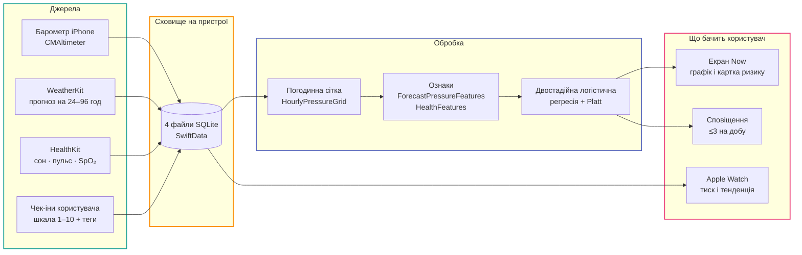

# Barosense

**Персональний трекер метеочутливості для iPhone та Apple Watch.**

Barosense знімає атмосферний тиск із вбудованого барометра iPhone, зіставляє його з
короткими самозвітами про самопочуття і будує **індивідуальну** модель того, як зміни
погоди корелюють зі станом конкретної людини. Коли модель бачить характерний для цього
користувача патерн — надсилає завчасне сповіщення.

--8<-- "generated/stats.md"

!!! warning "Не медичний застосунок"
    Barosense відстежує **особисті патерни самопочуття**. Він не ставить діагнозів, не
    лікує, не запобігає захворюванням і не замінює консультацію лікаря. Це не стильова
    вимога, а обмеження App Review (Guideline 1.4.1 / 5.1.1) — див.
    [Приватність і відповідність](privacy/index.md).

## З чого почати

### :material-map: Огляд системи
Як влаштований застосунок: таргети, межа `Shared/`, шлях даних від сенсора до екрана.

[Архітектура →](overview/architecture.md)

### :material-database: База даних
Чотири окремі файли SQLite, дев'ять таблиць, ER-діаграма, згенерована з коду.

[Схема →](database/index.md)

### :material-chart-bell-curve: ML-конвеєр
Дві мітки, реєстр ознак, forward-chaining валідація, виміряні метрики й базові лінії.

[ML →](ml/index.md)

### :material-book-open-variant: Довідник API
Сторінка на кожен `.swift`-файл, з описом кожного типу, методу й властивості — і
списком **усіх місць виклику**.

[Довідник →](reference/index.md)

### :material-shield-lock: Приватність
Що збирається, що нікуди не йде, які дозволи запитуються і навіщо саме кожен.

[Приватність →](privacy/index.md)

### :material-hammer-wrench: Розробка
XcodeGen, `xcodebuild`, SwiftLint, guards, CI, pre-commit hook.

[Збірка й тести →](dev/build.md)

## Ідея

Метеозалежність суб'єктивна. Хтось реагує на різке падіння тиску, хтось — на затяжний
низький, хтось узагалі не на тиск, а на недосип. Універсальні «погодні прогнози для
метеозалежних» тому й марні: вони усереднюють людей, які реагують по-різному.

Barosense не намагається вгадати «загальну» реакцію. Він навчається **на власній історії
користувача** — і прямо показує, коли даних ще замало для висновків.

## Як це працює за одну хвилину

Детальніше — [Потік даних](overview/data-flow.md).

## Незмінні обмеження проєкту

Ці п'ять правил переважають зручність. Вони записані в
[`CLAUDE.md`](https://github.com/s-rybak/barosense/blob/main/CLAUDE.md) і повторені тут,
бо решта документації постійно на них посилається.

| # | Обмеження | Де перевіряється |
| --- | --- | --- |
| 1 | **Жодних медичних тверджень** у копії, коментарях та іменах API | `scripts/ci/check-copy-vocabulary.sh` |
| 2 | **Дані про здоров'я не залишають пристрій** без окремої явної згоди | `scripts/ci/check-network-egress.sh` |
| 3 | **Дозволи HealthKit — точково**: тільки типи, у яких є споживач | `scripts/ci/check-healthkit-sync.sh` |
| 4 | **Бюджет батареї watchOS** — обов'язкове обґрунтування кожного таймера | ревʼю + `ml-spec.md` battery notes |
| 5 | **Cold start працює** з 3–7 днів історії | популяційний пріор `WellbeingRiskPrior` |

## Стек

| Область | Технологія |
| --- | --- |
| Мова / UI | Swift 6, SwiftUI |
| Мінімальна ОС | iOS 26.0 / watchOS 26.0 |
| Барометр | `CoreMotion.CMAltimeter` |
| Здоров'я | HealthKit (`HKHealthStore`, observer queries) |
| Погода | WeatherKit |
| ML | On-device логістична регресія + Platt-калібрування |
| Persistence | SwiftData (CloudKit вимкнено свідомо) |
| Голос / автоматизація | App Intents |
| Тести | XCTest |
| Проєктний файл | XcodeGen (`project.yml`) |

## Джерела правди

Документація на цьому сайті — **навігація й пояснення** поверх двох довгих специфікацій.
Числа беруться звідти; дублювати їх не можна, бо дві копії розходяться.

- [`.claude/context/ml-spec.md`](https://github.com/s-rybak/barosense/blob/main/.claude/context/ml-spec.md)
  — реєстр ознак, визначення міток, протокол валідації, battery notes.
- [`.claude/context/pressure-forecast-spec.md`](https://github.com/s-rybak/barosense/blob/main/.claude/context/pressure-forecast-spec.md)
  — ТЗ на прогноз локального тиску.

Якщо специфікація суперечить коду — баг у специфікації, і його виправляють у тому ж PR.
