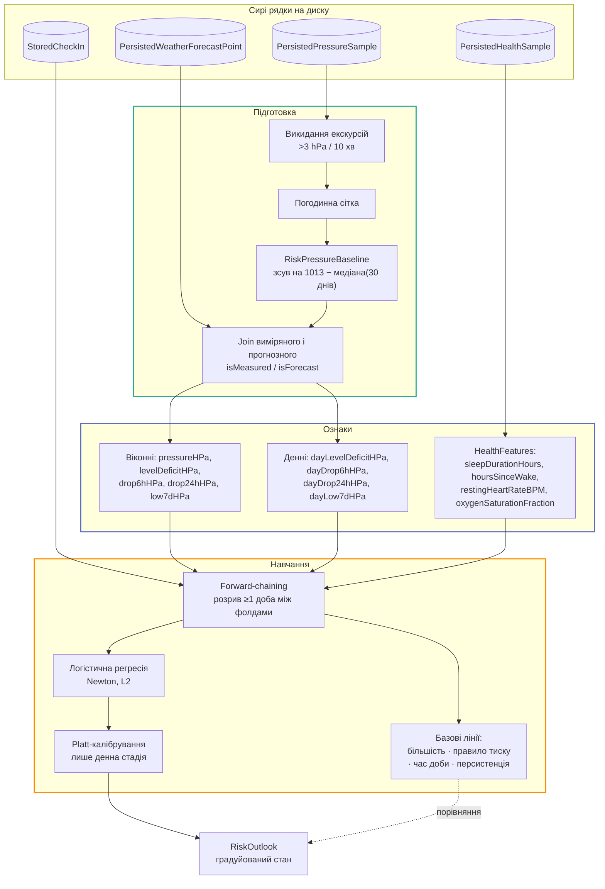

# ML-конвеєр

!!! abstract "Джерело правди"
    Реєстр ознак, визначення міток і протокол валідації живуть у
    [`.claude/context/ml-spec.md`](https://github.com/s-rybak/barosense/blob/main/.claude/context/ml-spec.md).
    Сторінки цього розділу — навігація й пояснення поверх нього, **не копія**. Якщо
    специфікація суперечить коду — баг у специфікації, і його правлять у тому ж PR.

## Три сторінки

| Сторінка | Що всередині |
| --- | --- |
| [Мітки](labels.md) | Дві різні мітки, дві одиниці прогнозу, і чому їх найлегше переплутати |
| [Ознаки](features.md) | Реєстр за родинами: барометр, прогноз, HealthKit, контекст, вікна ризику |
| [Валідація і метрики](validation.md) | Forward-chaining, базові лінії, виміряні числа й два нельстиві результати |

## Конвеєр цілком

## П'ять правил, які не обговорюються

1. **Валідація тільки forward-chaining.** Випадковий k-fold протікає майбутнім у минуле і
   відхиляється на ревʼю без винятків.
2. **Метрики — на позитивному класі.** Precision, recall, PR-AUC, базова частота, `n`,
   кількість позитивних. Сама по собі accuracy неприйнятна: позитивний клас рідкісний, і
   предиктор більшості на ній виглядає добре, будучи некорисним.
3. **Перемогти всі базові лінії або сказати прямо, що не вийшло.** Модель, яка програє
   пороговому правилу, коштує батареї й додає ризику ні за що.
4. **Ніколи не подавати вихід як певність.** На екран іде градуйований стан, не «так/ні».
5. **Немає рядка в реєстрі — немає ознаки в моделі.**

## Пряме перенесення з дослідницького ноутбука

Модель — не Core ML-файл, а логістична регресія, реалізована в Swift
([`LogisticRegressionModel`](../reference/Shared/Risk/LogisticRegressionModel.md)), плюс
Platt-корекція. Це дозволяє дві речі, яких `.mlmodel` не дав би:

- **звірку коефіцієнтів із scikit-learn** прямо в юніт-тесті (`SklearnFixture`);
- **локальне донавчання** без `MLUpdateTask` і без бандла з моделлю, який треба оновлювати
  релізом.

## Що вимірюється, а що припускається

| Твердження | Статус |
| --- | --- |
| PR-AUC віконної стадії 0,407 при базовій частоті 0,098 | **Виміряно** на синтетичній трасі, 4 фолди, 60 днів |
| Platt удвічі зменшує Brier денної стадії (0,197 → 0,124) | **Виміряно** |
| Денна стадія **не перемагає константу** за Brier (0,124 проти 0,103) | **Виміряно і записано**, бо це нельстиво |
| Поріг «погане самопочуття» = 7 з 10 | **Провізорний** — обраний із міркувань, не з даних |
| Базова частота користувача | **Невідома.** Вона персональна, і її не можна припускати. Звітується по фолдах, ніколи не підставляється з літератури |
| Вартість фіту на пристрої | **Не виміряна.** Оцінена за порядком відносно `LocalPressureModel` |

!!! danger "Кожне число — це стеля"
    Траса синтетична, і в її генератор **явно вписаний барометричний ефект**: падіння на
    10 hPa за шість годин робить слот приблизно в три тисячі разів імовірнішим для запису.
    Одна змодельована людина, 90 записів. Ніщо з цього не є оцінкою того, що застосунок
    зробить для реального користувача.

## Обов'язкові тестові фікстури

Конвеєр запускається з простого XCTest на синтетичному вході — без `HKHealthStore`, без
`CMAltimeter`, без мережі. Обов'язкові випадки:

- [x] чистий погодинний ряд тиску, 14 днів;
- [x] ряд із пропуском на 12 год — покриття має впасти, ознаки стати `nil`, ніщо не має
      впасти з помилкою;
- [x] стрибок ~10 hPa за 5 хв — висота, має бути **відкинута**, а не вивчена;
- [x] користувач із 3 днями історії — cold start має все одно дати вихід;
- [x] користувач із нулем позитивних міток — метрики мають деградувати контрольовано, а не
      ділитися на нуль;
- [x] вхід у кПа, що дійшов до межі, — має бути відкинутий або сконвертований, ніколи не
      «тихо в 10 разів мимо».
