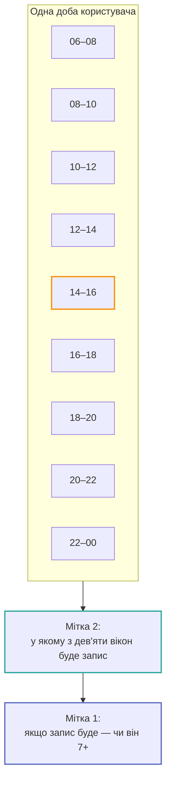

# Дві мітки

У цьому застосунку **дві** мітки, і вони відповідають на різні питання. Плутанина між ними
— найлегший спосіб зробити хибне твердження на екрані.

## Мітка 1: «погане самопочуття»

```
poorWellbeing(checkIn) = checkIn.intensity >= 7    // шкала 1–10, 10 = найгірше
```

Визначена **один раз**, як
[`WellbeingLabel.poorWellbeingThreshold`](../reference/Shared/Models/WellbeingLabel.md). Ніколи
не вбудовується в місце виклику: друга копія розійшлася б і тихо знецінила кожну виміряну
метрику.

!!! warning "Шкала йде у зворотний бік від оцінки самопочуття"
    Форма питає **інтенсивність** — наскільки сильно це відчувалось. Тому 10 — це
    найгірший кінець, і порівняння `>=`, а не `<=`.

    Тип названий `CheckInIntensity`, а не `Score`, саме для того, щоб напрямок неможливо
    було припустити з ідентифікатора: порівняння, написане навпаки, дає рівно протилежну
    мітку і при цьому компілюється.

### Чому саме 7

**Верхні чотири з десяти** — це ті самі 40% діапазону, які покривали нижні два з п'яти на
попередній шкалі 1–5. Перенесено, а не переобрано: перехід на дрібнішу шкалу не мав тихо
зсунути визначення події.

`5` і `6` — це середина. Згорнувши їх усередину, базова частота поповзла б до половини всіх
чек-інів, і звичайні дні почали б рахуватися подіями.

**Провізорно.** Обрано з міркувань, не з даних. Зміна порогу знецінює кожну збережену
метрику — базові лінії переганяються в тій самій зміні.

### Що у мітку не входить

| Дані | Записується | Входить у мітку v1 |
| --- | --- | --- |
| Інтенсивність 1–10 | так | **так** |
| Теги | так | ні |
| Ліки (`MedicationEntry`) | так | ні |
| `note` (вільний текст) | так | **ніколи** — це необмежений користувацький текст |
| Контекст здоров'я на момент чек-іну | так | ні |

Теги зберігаються за **ідентичністю**, а не за текстом. Словник відкритий і персональний:
користувач додає, перейменовує і архівує. Наслідки:

- пер-тегові ознаки можливі **лише в персональній моделі** — користувацький id нічого не
  означає на іншому пристрої і ніколи не може потрапити в популяційний пріор;
- словник необмежений, тож one-hot по всіх тегах неможливий. Будь-що з тегів має бути
  зведенням фіксованої ширини (лічильник, «є/немає», по seeded-id).

## Мітка 2: «стався чек-ін»

```
checkInOccurred(window) = any CheckIn with timestamp in [window.start, window.end)
```

Без порога, без інтенсивності: подія — це те, що користувач **зробив запис**, хоч би що він
у ньому вказав.

Це мітка про **поведінку**, а не про тіло. Кожна поверхня, побудована на ній, так і каже:
рядок графіка читається «сьогодні ймовірний чек-ін», ніколи — «попереду важчий день».

### Навіщо вона взагалі

Мітка №1 вимагає, щоб користувач **і записав, і записав 7+**. На 120-денній трасі це
рідкісна подія всередині рідкісної. Виникнення — зовнішня з двох, і саме для неї
дослідницький ноутбук знайшов барометричний сигнал.

### Порівняння

| | Мітка 1 | Мітка 2 |
| --- | --- | --- |
| Питання | Чи буде цей чек-ін поганим | Чи буде запис у цьому вікні |
| Одиниця прогнозу | Один рядок на чек-ін | Один рядок на **двогодинне вікно дня неспання** |
| Базова частота | Персональна, **невідома** | ~1 вікно з 9 у добу із записом |
| Визначена на добі без записів | Ні | **Так** |
| Має навчений споживач | Ні (v1) | **Так** |
| Де в коді | [`WellbeingLabel`](../reference/Shared/Models/WellbeingLabel.md) | [`RiskWindowGeometry`](../reference/Shared/Risk/RiskWindowGeometry.md) + `RiskWindowRow.isLogged` |



## Ніч — це домен, а не ознака

Дев'ять вікон, а не дванадцять: до пробудження користувач не може зробити запис. Межа доби
читається з **раннього хвоста** його власних годин записів (5-й перцентиль), ніколи — з
найчастішої години: остання була б ознакою «час доби», а час доби міряється окремо і
свідомо виключений із домену (`RiskBaseline.timeOfDay`).

Межа будується з компонентів дати, тож тримає свою годину за настінним годинником через
перехід на літній час; вікна всередині доби викладаються в абсолютних годинах від неї — що
робить два дні переходу 23- і 25-годинними.

## Відкрите питання

Розширення мітки до `intensity >= 6 && !tagIDs.isEmpty` — питання §9 специфікації, а не
дрібна зміна. Так само `MedicationEntry.takenAt` (це не текст, і з нього могла б вийти
ознака «годин від останнього прийому») — але це поле найімовірніше буде хибним, бо
користувач вводить його з пам'яті.
