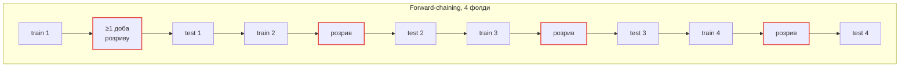

# Валідація і метрики

## Протокол



| Правило | Значення |
| --- | --- |
| Тип розбиття | **Тільки forward-chaining, на користувача.** Випадковий k-fold протікає майбутнім у минуле і відхиляється на ревʼю без винятків |
| Розрив між train і test | `WellbeingRiskTrainer.foldGapDays = 1` |
| Мінімум фолдів | 3, тестовий фолд ≥3 дні |
| Cold start | Leave-one-user-out на пріорі, оцінка **лише на перших 7 днях** користувача — це число відповідає на питання «чи працює застосунок на третій день» |
| Фолд без позитивних подій | Виключається з precision цього фолда, **і виключення звітується**. Не усереднюється мовчки |

!!! warning "Свідоме відхилення від «розрив = найдовше вікно ознаки»"
    Специфікація просить розрив ≥24 год, «інакше 24-годинні ознаки перетнуть межу і
    протечуть однаково». Раніше це було «найдовше вікно ознаки», і вже не є: §2.5 додав
    `low7dHPa` — семиденне ковзне середнє, — а `foldGapDays` лишився **1**.

    Відхилення заявлене, а не мовчки прийняте: сім днів між кожним фолдом коштують чверть
    місяця історії заради ознаки з **найменшим** коефіцієнтом у моделі (0,042 проти 1,35 у
    `drop6hHPa`). Переглянути, якщо цей коефіцієнт колись виросте.

## Що звітується

На **позитивному класі**, для кожної зміни моделі:

`precision` · `recall` · `PR-AUC` · базова частота · `n` · кількість позитивних.

Сама по собі accuracy неприйнятна.

## Базові лінії

Перемогти **всі** або сказати прямо в тілі PR, що не вдалося.

| # | Базова лінія | Що робить |
| --- | --- | --- |
| 1 | Більшість | Завжди відповідати «не погано» |
| 2 | Правило тиску | `pressureDeltaHPaPer6h < -X`, `X` підбирається **лише на train** |
| 3 | Персистенція | Повторити мітку попереднього чек-іну |
| 4 | Час доби | Ранжування за годиною — перевірка, що модель не вивчила розклад людини |

Базова лінія №3 — найчесніша: самозвітне самопочуття автокорельоване, і погодна модель,
яка не б'є «вчора повторилось», не продемонструвала погодного сигналу.

[`WellbeingRiskTrainer`](../reference/Shared/Risk/WellbeingRiskTrainer.md) ганяє всі
чотири на кожному проході валідації і пише результат у `BarosenseLog.pressure`;
`RiskModelReport.beatsEveryBaseline` — це підсумок.

## Виміряні числа

Із `WellbeingRiskPipelineTests` на 120-денній синтетичній трасі дослідницького ноутбука,
перебудованій на погодинну сітку цього застосунку. Чотири forward-chaining фолди, 60
оцінених днів.

| Метрика | Значення | Проти чого читати |
| --- | --- | --- |
| PR-AUC вікна | **0,407** | базова частота 0,098 → **lift 4,15** |
| ROC-AUC вікна | 0,784 | 0,5 |
| hit@1 / добу | **0,358** | 0,111 навмання |
| hit@2 / добу *(це малює графік)* | **0,604** | 0,222 навмання |
| ROC-AUC доби | 0,747 | 0,5 |
| Brier доби | 0,124 | 0,197 без калібрування; **0,103 просто відповідаючи базову частоту** |
| Гейт | **2,45 повідомлення/тиждень при precision 0,810**, 95% CI [0,60; 0,92] | recall 0,321, спрацював 21/60 днів |

Базові лінії за PR-AUC: правило тиску 0,175, час доби 0,134, персистенція 0,107,
більшість 0,102. **Навчена віконна стадія б'є всі чотири.**

## Два нельстиві результати

Записані тут, а не залишені на «колись знайдуть».

### 1. Денна стадія не б'є константу

Її калібрований Brier — 0,124 проти 0,103 у простої відповіді базовою частотою.

Це властивість траси: **53 з 60 оцінених днів містять запис**, тож розрізняти майже нічого.
Стадія все одно **ранжує** дні на ROC-AUC 0,747, і саме для цього її використовує фільтр
«тихий день». Але відсоток на екрані на цих даних коштує менше, ніж коштувала б константа.
`RiskModelReport.Stage.beatsConstantBrier` несе це кожен прогін.

### 2. Кожне число тут — стеля

Траса синтетична, і в її генератор **явно вписаний барометричний ефект**: падіння на 10 hPa
за шість годин робить слот приблизно в три тисячі разів імовірнішим для запису. Одна
змодельована людина, 90 записів.

Ніщо тут не є оцінкою того, що застосунок зробить для реального користувача, і відвантажений
пріор успадковує те саме обмеження.

## Калібрування

Вимірюється, а не припускається. Platt-корекція **вдвічі зменшує** Brier денної стадії
(0,197 → 0,124), не чіпаючи її впорядкування, — і це єдине, що взагалі дає право на
відсоток на екрані.

Віконна стадія калібрування **не має**: вона використовується лише для ранжування, і ніщо
не порівнює її вихід із фіксованим числом. Дві зайві підігнані величини без споживача були
б просто двома зайвими величинами.

## Поріг рішення

Модель віддає ймовірність; продукт надсилає сповіщення. Це різні речі.

| Правило | Значення | Статус |
| --- | --- | --- |
| Поріг обирається на фолдах валідації, **ніколи на test** | — | тверде |
| Ship gate | **precision ≥ 0,5** на позитивному класі, при будь-якому recall | *провізорне* |
| Стеля | **≤1 випереджувальне сповіщення на добу** | *провізорне* |
| Вихід на екрані | Градуйований стан, ніколи «так/ні» і ніколи відсоток, поданий як факт | тверде |

Хибне випереджувальне попередження руйнує довіру швидше, ніж пропуск втрачає цінність.
Стеля обмежує шкоду від поганого порогу і **не залежить від якості моделі**.

Обидва провізорні числа — продуктові рішення. Вони узгоджуються з людиною перед
відвантаженням.

## Як перезапустити оцінку

Є слеш-команда, яка проганяє регресію метрик і формує таблицю для тіла PR:

```bash
/ml-eval
```

Опис — у
[`.claude/commands/`](https://github.com/s-rybak/barosense/blob/main/.claude/commands/).
