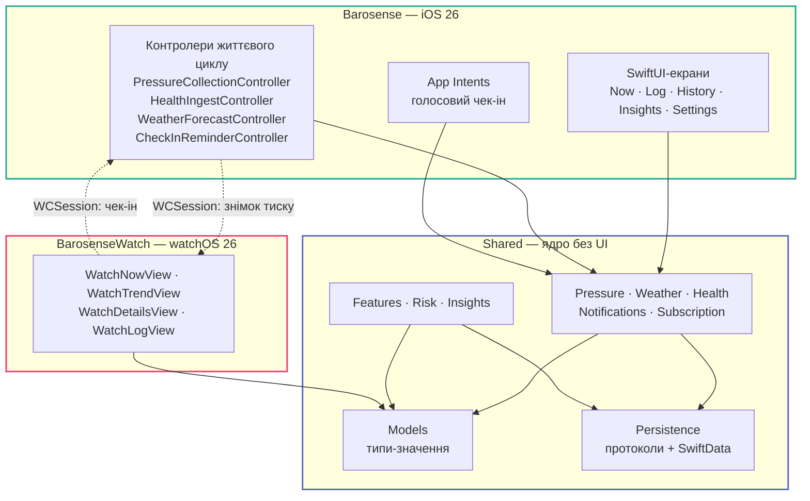
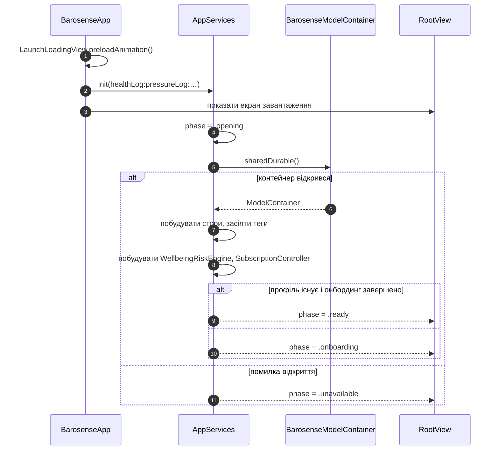

# Архітектура

## Три таргети, одна межа



**Правило одне: усе, що може жити в `Shared/`, живе в `Shared/`.** Платформні таргети
містять в'юшки та платформну обв'язку — і нічого більше.

Це не побажання, а те, що перевіряє компілятор і лінтер. Кастомне правило SwiftLint
`shared_ui_free` робить помилкою будь-який `import SwiftUI`, `import UIKit` чи
`import WatchKit` усередині `Shared/`:

```yaml title=".swiftlint.yml"
custom_rules:
  shared_ui_free:
    regex: '^import (SwiftUI|UIKit|WatchKit)\b'
    included: "(^|/)Shared/.*\\.swift"
    severity: error
```

Наслідок, заради якого все це робиться: **ML-конвеєр запускається зі звичайного XCTest на
синтетичному вході** — без `HKHealthStore`, без `CMAltimeter`, без мережі.

Що межа ціла — можна перевірити не на слово: [граф модулів](../generated/module-graph.md)
будується з того самого індексу звернень і показує кожне ребро між теками.

## Композиційний корінь

Єдине місце, яке знає, яка реалізація сховища справжня, —
[`AppServices`](../reference/Barosense/AppComposition.md). Усе нижче за течією приймає
протоколи, і саме це тримає флоу тестованим, а залежність від SwiftData — поза в'юшками.



Чотири фази — це і є вся модель станів запуску:

| Фаза | Що показано | Чому окремо |
| --- | --- | --- |
| `.opening` | екран завантаження | Показати онбординг до читання профілю означає перезапустити флоу, який користувач уже пройшов |
| `.unavailable` | помилка | Корисного деградованого режиму немає: сенс застосунку — накопичена історія |
| `.onboarding` | 12-кроковий флоу | Профіль ще не створено |
| `.ready` | таб-бар | Звичайна робота |

Мінімальна тривалість екрана завантаження зафіксована в
`AppServices.minimumLoadingDuration` — це час одного циклу анімації із 97 кадрів.

## Патерн «контролер + сервіс»

Скрізь однаково:

<div class="bs-grid" markdown>

<div class="bs-card" markdown>
### `*Controller` в iOS-таргеті
Володіє **життєвим циклом**: сценою, дозволом, `BGAppRefreshTask`, `WCSession`,
`UNUserNotificationCenter`. Не має логіки, яку варто тестувати.
</div>

<div class="bs-card" markdown>
### Сервіс у `Shared/`
Володіє **рішенням**: коли брати зразок, чи вистачає покриття, який поріг, що показати.
Приймає протокол, конструюється в тесті з дублером.
</div>

</div>

Приклад пари:
[`PressureCollectionController`](../reference/Barosense/Pressure/PressureCollectionController.md)
(реєструє фонове завдання, стартує `CMAltimeter`) →
[`PressureSampleRecorder`](../reference/Shared/Pressure/PressureSampleRecorder.md)
(вирішує, чи минуло 15 хвилин, і чи правдоподібне значення).

## Ізоляція та конкурентність

`SWIFT_STRICT_CONCURRENCY: complete`, Swift 6. Наслідки, які видно всюди в коді:

- Кожне сховище SwiftData — це `@ModelActor`. Ні `ModelContext`, ні `@Model`-інстанс
  **ніколи не перетинають межу ізоляції**; назовні віддаються типи-значення з
  `Shared/Models/`.
- Довгі обчислення (ризик-модель, локальна модель тиску) — в `actor`, а не на
  `@MainActor`.
- Кастомне правило `no_mainactor_task_hop` забороняє `Task { @MainActor in }` як спосіб
  заглушити ворнінг ізоляції: власність виправляють, а не ховають.
- Нових залежностей від Combine не додають (`no_new_combine`) — колбеки загортають у
  `AsyncStream` / `withCheckedContinuation`.

## Kill switches

Кожна підсистема, яка витрачає батарею або змінює прогноз, має статичний вимикач. Це
вимога `swift_conventions`: якщо Instruments покаже неприйнятну витрату, зміна має бути
однорядковою.

| Вимикач | Де | Що вимикає |
| --- | --- | --- |
| `PressureSamplingPolicy.isBackgroundRefreshEnabled` | [`PressureSampleRecorder`](../reference/Shared/Pressure/PressureSampleRecorder.md) | Фоновий збір тиску; foreground залишається |
| `HealthBackgroundDelivery.isEnabled` | [`HealthChangeObserving`](../reference/Shared/Health/HealthChangeObserving.md) | Фонову доставку HealthKit |
| `WellbeingRiskEngine.isEnabled` | [`WellbeingRiskEngine`](../reference/Shared/Risk/WellbeingRiskEngine.md) | Увесь прогноз ризику; екрани малюються як до появи підсистеми |

## Мережа

Єдиний вихідний трафік — WeatherKit. Це перевіряється guard-скриптом
`scripts/ci/check-network-egress.sh`, а не тільки ревʼю. Деталі й межі —
[Приватність](../privacy/index.md).

## Куди далі

- [Потік даних](data-flow.md) — той самий малюнок, але з боку одного зразка
- [Структура проєкту](structure.md) — де що лежить
- [Довідник API](../reference/index.md) — кожен файл окремо
