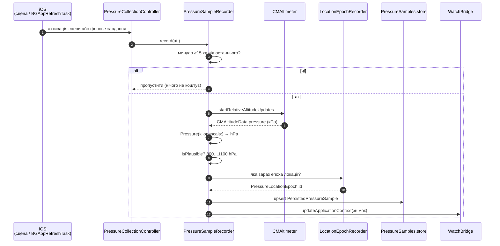
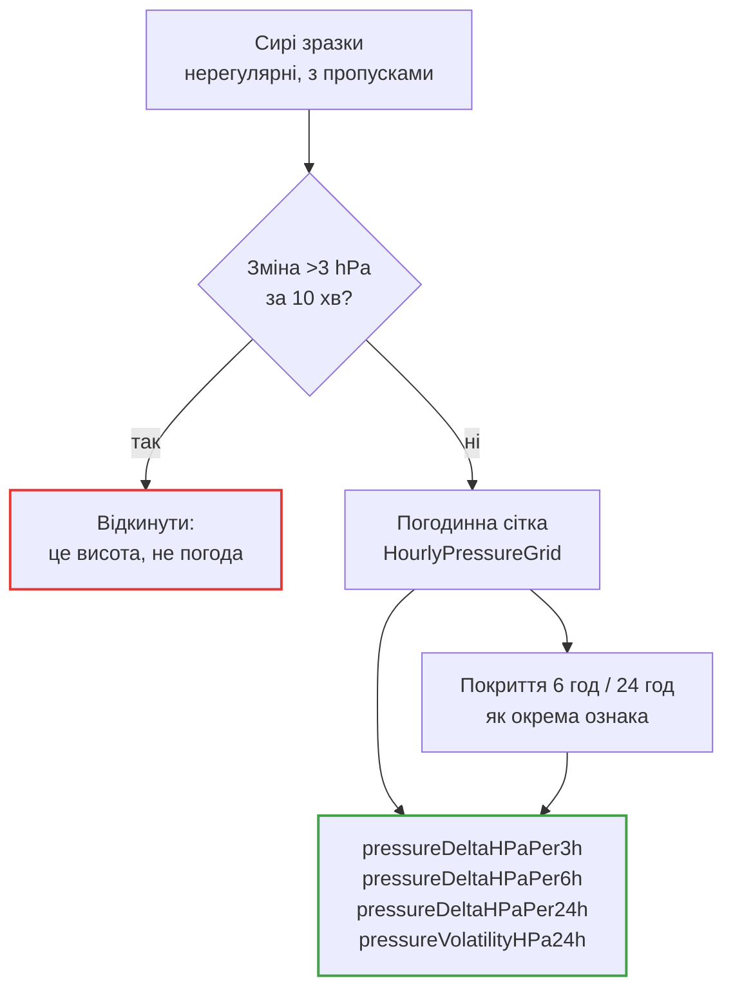
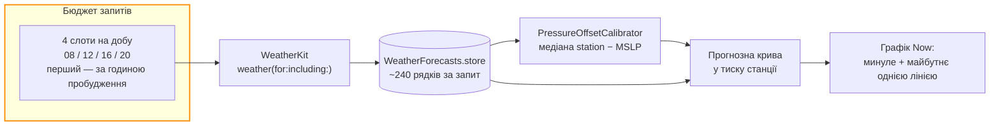
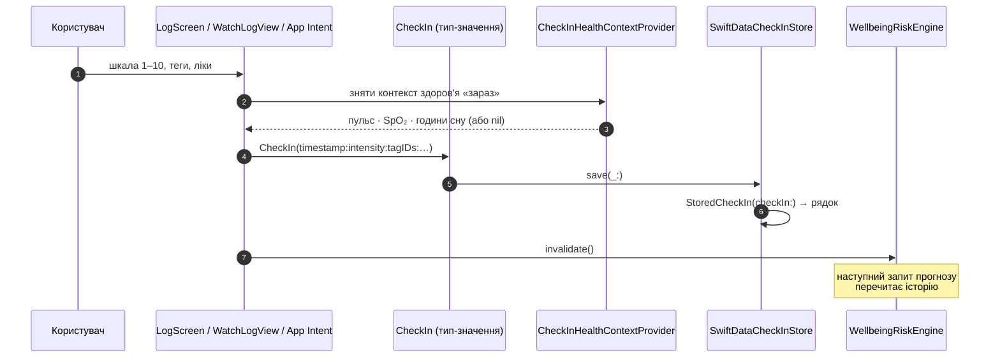
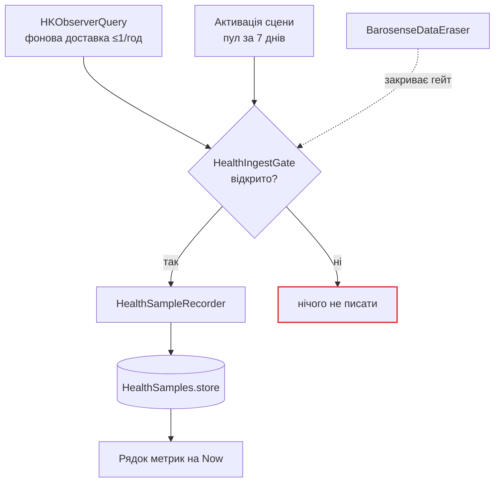
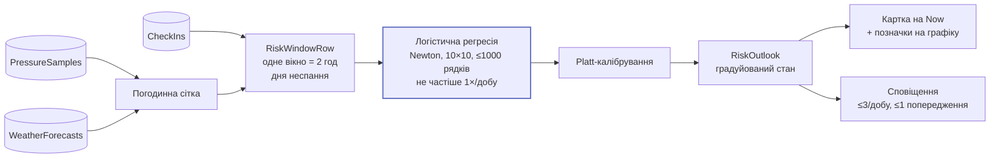

# Потік даних

Одна сторінка, чотири маршрути. Кожен починається із зовнішнього джерела і закінчується
на екрані або в сповіщенні.

## 1. Тиск: від сенсора до графіка

Ключові рішення на цьому маршруті:

| Рішення | Значення | Де записано |
| --- | --- | --- |
| Мінімальний інтервал між зразками | **15 хв** | [`PressureSamplingPolicy.minimumIntervalSeconds`](../reference/Shared/Pressure/PressureSampleRecorder.md) |
| Що просимо в iOS для фонового пробудження | 15 хв (це **підлога**, не частота) | `backgroundRefreshIntervalSeconds` |
| Верхня межа зчитувань на добу | 96 | `ml-spec.md` § battery notes |
| Діапазон правдоподібності | 800–1100 hPa | [`Pressure.isPlausible`](../reference/Shared/Models/Pressure.md) |

!!! info "15 хвилин обрано для дельт, а не для самого тиску"
    Ознака `pressureHPa` толерує зразок віком до 90 хв. Але
    `pressureDeltaHPaPer3h` на погодинній сітці — це 3 точки, а на 15-хвилинній — 12.
    Роздільність дельти і є причиною частоти.

## 2. Сирий тиск → ознаки

Барометр міряє **тиск станції**. Поїздка ліфтом дає такий самий стрибок, як атмосферний
фронт. Два механізми відділяють одне від одного:

**Пропуски залишаються пропусками.** Нічого не інтерполюється через дірку, бо вигадане
значення нижче за течією не відрізнити від виміряного. Замість інтерполяції модель
отримує число покриття і сама вирішує, наскільки довіряти дельті.

Поріг `3 hPa / 10 хв` — це 18 hPa/год, тобто на два порядки більше за все, що робить
атмосфера (≤2 hPa/год навіть у швидкому циклоні).

## 3. Погода: WeatherKit і калібрування зсуву

WeatherKit віддає тиск, зведений до рівня моря (MSLP). Барометр міряє тиск станції. Різниця
навколо Києва (≈180 м) — близько **−22 hPa**, і вона не стала: Apple зводить тиск «за
спостережуваними умовами», тож зсув рухається з температурою. Тому
[`PressureOffset`](../reference/Shared/Weather/PressureOffsetCalibrator.md) зберігає не
одне число, а трійку: зсув, температуру вимірювання та кількість пар, з яких взято медіану.

Квота: 4 запити/добу × 30 = 120/місяць на пристрій, проти 500 000/місяць на членство
Apple Developer Program ≈ **4 160 пристроїв**. Перевіряти повторно, коли база наблизиться.

## 4. Чек-ін: від тапу до навчальної розмітки

Три речі, які легко зрозуміти неправильно:

1. **`timestamp` — це коли користувач повідомив, а не коли рядок дійшов до сховища.**
   Ознаки рахуються на цей момент.
2. **Теги зберігаються за ідентичністю, не за текстом.** Перейменування тега не переписує
   історію чек-інів.
3. **`note` і текст ліків ніколи не стають ознакою** і ніколи не потрапляють у вихідний
   payload. Це необмежений користувацький текст.

## 5. Здоров'я: два шляхи запису

[`HealthIngestGate`](../reference/Shared/Health/HealthIngestGate.md) існує через конкретний
баг: «видалити мої дані» очищав лог, але спостерігачі HealthKit про це не знали і на
наступному спрацюванні клали той самий тиждень назад. Алерт обіцяв, що даних немає, — а
через хвилини вони були.

Гейт **закритий при створенні** і відкривається, коли онбординг позаду. Оскільки цей факт
живе у профілі на диску, а не в об'єкті, призупинення переживає перезапуск.

## 6. Ризик: від рядків до картки на екрані

Дві стадії, дві різні мітки, дві різні одиниці прогнозу — це найлегша річ, яку можна
переплутати. Розбір: [Мітки](../ml/labels.md).

**Прогноз ніколи не подається як факт.** На екран іде градуйований стан, не «так/ні» і не
відсоток, поданий як істина. Це вимога `CLAUDE.md` і одночасно вимога App Review.

## Що коли перераховується

| Подія | Що відбувається | Вартість |
| --- | --- | --- |
| Активація сцени | зразок тиску (якщо минуло 15 хв), пул Health, реконсиляція нагадувань | ≈1 с барометра |
| `BGAppRefreshTask` | те саме без UI | ≈1 с барометра |
| Спрацювання `HKObserverQuery` | один запит за 48 год + upsert | без сенсорів |
| Новий чек-ін | `invalidate()` на ризик-моделі | наступний запит перечитає |
| Запит прогнозу ризику | мемоізовано на **15 хв** | 0, якщо в межах вікна |
| Перенавчання моделі | не частіше **1×/добу** | ~10⁵ множень-додавань |
| Слот WeatherKit | 1 мережевий запит + ~240 рядків | 4–5 разів на добу |
