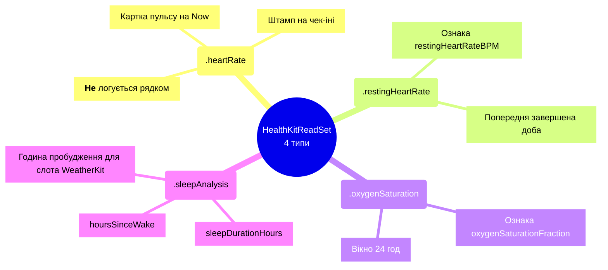

# Дозволи HealthKit

## Правило «спочатку споживач»

**Тип не запитується, доки в нього немає споживача.** Додати тип до read-сету означає
додати разом із ним рядок у реєстрі ознак і код, який його читає, — інакше користувача
просять погодитись на дозвіл, який нічого не робить.

Це обмеження №3 з `CLAUDE.md`, і воно перевіряється скриптом:

```bash
scripts/ci/check-healthkit-sync.sh
```

## Чотири типи



Список існує в **одному** місці —
[`HealthKitReadSet`](../reference/Shared/Health/HealthKitReadSet.md). Другий споживач, який
його змусив виникнути, — перемикач у Налаштуваннях: він має спитати iOS, чи користувача вже
питали про **всі** типи, і друга копія списку зробила б так, що перемикач звітує про набір,
який рідер більше не запитує.

`switch` замість словника — щоб компілятор зупинявся на новій метриці й питав, який тип
HealthKit за нею стоїть.

## Синхронізація в чотирьох місцях

Додавання типу вимагає узгодженої зміни у всіх чотирьох:

| Місце | Що там |
| --- | --- |
| `HealthKitReadSet.sampleType(for:)` | Сам тип |
| `Barosense.entitlements` / `BarosenseWatch.entitlements` | `com.apple.developer.healthkit.access` |
| `project.yml` → `INFOPLIST_KEY_NSHealthShareUsageDescription` | Purpose string, що згадує нову категорію |
| App Store Connect → Privacy nutrition label | Декларація типу даних |

Розбіжність між ними — або відхилення на ревʼю, або промпт, який просить того, чого
застосунок не використовує.

## Асиметрія: HealthKit не розкриває відмову

`authorizationStatus(for:)` для **читання** навмисно не відрізняє «користувач відмовив» від
«даних немає». Apple зробила це, щоб застосунок не міг вивести факт наявності в людини
певних даних із самого факту відмови.

Наслідки в коді:

1. [`HealthAccessState`](../reference/Shared/Health/HealthAccessReporting.md) і
   `BarometerAccessState` — **два різні типи**, які свідомо не злиті. Барометр про свій стан
   каже правду в обидва боки; HealthKit — ні. Об'єднання запросило б підпис «відмовлено» про
   стан, якого HealthKit ніколи не показує.
2. Кожна ознака з HealthKit має бути **відкидною** зі заявленим зниженням упевненості, а не
   жорсткою вимогою. Це те саме правило, що покриває інший випадок: доступність Blood Oxygen
   залежить від моделі годинника й регіону.
3. Перемикач у Налаштуваннях питає iOS не «чи дозволено», а «чи користувача вже питали».

## Що з HealthKit **не** робиться

| | Чому |
| --- | --- |
| Не пишеться нічого | Немає жодної фічі, яка б це потребувала. Тому й share-сету немає |
| Не читається HRV (`.heartRateVariabilitySDNN`) | У реєстрі є як `planned`, але **споживача немає** → не авторизовано |
| Не логуються beat-to-beat зчити пульсу | ~2 000 рядків на тиждень, яких не читає жодна ознака |
| Не логуються `inBed` і `awake` сегменти сну | `inBed` — це не сон; `awake` не має споживача (і саме це блокує `sleepAwakeningCount`) |
| Дані HealthKit не видаляються під час erase | Ці рядки належать застосунку «Здоров'я», їх лише читали |

## Вікна показу vs вікна ознак

Це різні речі, і плутати їх — помилка.

| | Показ на Now (`HealthMetricsWindow`) | Ознака на `t` |
| --- | --- | --- |
| Пульс | свіжість 2 год | не ознака |
| Пульс спокою | 48 год | попередня **завершена** доба |
| SpO₂ | 24 год | останній із `end <= t` у межах 24 год |
| Сон | останні 24 год | сесія, що завершилась ≤24 год до `t` |
| Lookback на оновлення | 7 днів | — |

Значення вікон показу **провізорні** і керують лише екраном Now. Ознака, порахована на `t`,
перевіконовує зі сховища заново і **не має успадковувати** їх.

## Процедура зміни

Будь-яка правка read-сету, entitlement або purpose string проходить через
[`healthkit_permissions`](https://github.com/s-rybak/barosense/blob/main/.claude/skills/healthkit_permissions/SKILL.md)
— це гейтована зміна, а не редагування файлу.
