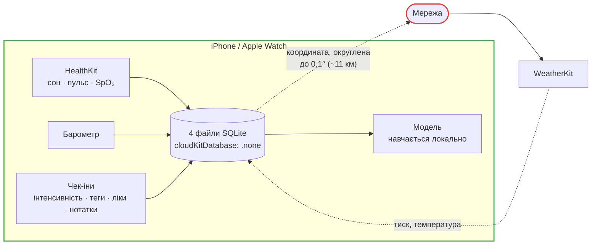

# Приватність і відповідність

## Правило нульового вивантаження

**Backend відсутній.** Уся обробка — на пристрої.



**Єдиний вихідний трафік — запити до WeatherKit.** Вони не несуть жодних даних про
здоров'я: у запит іде округлена координата й нічого більше.

Це перевіряється скриптом, а не тільки ревʼю:

```bash
scripts/ci/check-network-egress.sh
```

## Що куди йде

| Дані | Зберігаються на пристрої | Йдуть у мережу | Синхронізуються |
| --- | --- | --- | --- |
| Чек-іни (інтенсивність, теги, ліки, нотатки) | так | **ніколи** | ні |
| Зразки барометра | так | **ніколи** | ні |
| Читання HealthKit | так | **ніколи** | ні |
| Профіль (ім'я, вік, аватар) | так | **ніколи** | ні |
| Координата | так, округлена до 0,1° | **так**, у WeatherKit | ні |
| Прогнози WeatherKit | так, 90 днів | вхідні | ні |
| Статус підписки | так | до App Store (StoreKit) | через акаунт Apple |

## CloudKit вимкнено свідомо

```swift
cloudKitDatabase: .none
```

Це **не дефолт, який переказали**: це обмеження №2 з `CLAUDE.md`, виражене в коді.
Чек-іни, словник тегів і профіль — дані про здоров'я або суміжні з ним. Синхронізація
будь-чого з цього вимагає окремої явної згоди плюс ADR, якого поки немає.

## Дозволи: рівно ті, у яких є споживач

| Дозвіл | Purpose string | Хто споживає |
| --- | --- | --- |
| **Motion & Fitness** (iOS) | «Barosense reads barometric pressure to track weather changes alongside your check-ins.» | `CMAltimeter` → лог тиску |
| **HealthKit (читання)** | «…reads your sleep, heart rate and blood oxygen to show them beside the pressure and to look for personal patterns…» | 4 типи, [деталі](healthkit.md) |
| **Локація (when in use)** | «Barosense uses your location to fetch the local pressure forecast.» | Запит у WeatherKit, епохи локації |
| **Сповіщення** | — (системний промпт) | Нагадування про чек-ін |

### Три речі, яких свідомо **немає**

**1. Немає точної локації.** `NSLocationDefaultAccuracyReduced = true` — запитується
**груба** локація, і користувачеві ніколи не пропонують «Точна: увімк.».

Причина не в делікатності, а в тому, що точної локації **нема кому споживати**: епохи
округляють кожну координату до 0,1° (~11 км) перед збереженням, а сітка WeatherKit ще
грубіша за GPS-фікс. Дозвіл без споживача — це рівно те, що забороняє обмеження №3.

Ключ прописаний реальним булевим значенням у `Barosense/Info.plist`, а не лише через
`INFOPLIST_KEY_*`-ін'єкцію: `<string>YES</string>` CoreLocation проігнорувала б, і
застосунок просив би точну локацію, поки кожен коментар у кодовій базі стверджував би
протилежне.

**2. Немає `NSMotionUsageDescription` на годиннику.** Годинник ніколи не торкається
CoreMotion. Purpose string для дозволу, якого ніхто не запитує, — це промпт, на який
користувача просять відповісти заради неіснуючої фічі.

**3. Немає запису в HealthKit.** Нічого в застосунку не пише в HealthKit, тож share-сету не
існує і перемикача запису користувачеві не показують.

## Фонові режими

```xml title="Barosense/Info.plist"
<key>UIBackgroundModes</key>
<array>
    <string>fetch</string>
</array>
```

Тільки `fetch`. **Немає** `processing` — робота це один зчит сенсора й один рядок, а не
довгий батч. **Немає** `location`, **немає** `audio` — ніщо тут не має права тримати
застосунок резидентним.

## Медичні формулювання

Обмеження №1: ніколи не стверджувати діагностику, лікування чи запобігання захворюванням —
ні в копії, ні в коментарях, ні в іменах API.

| Дозволено | Заборонено |
| --- | --- |
| tracking / відстеження | diagnose / діагноз |
| personal patterns / особисті патерни | predicts your migraine / передбачає ваш мігрень |
| wellbeing companion | prevents / запобігає |
| your history suggests / ваша історія показує | treats / лікує |
| | medical / медичний |

Це **ризик відхилення на App Review** (Guideline 1.4.1 / 5.1.1), а не стильова вподоба.
Перевіряє `scripts/ci/check-copy-vocabulary.sh`.

Найризикованіша поверхня — [PDF-звіт](../subsystems/reports.md): його читає лікар, і
документ, який виглядає як медичний висновок, і є та причина, з якої відхиляють.

## «Видалити мої дані»

Вісім сховищ у трьох контейнерах, кожне пробується навіть після відмови попереднього,
помилка називає, що **вціліло**. Деталі й перелік того, чого erase свідомо не чіпає, —
[Життєвий цикл даних](../database/lifecycle.md#видалити-мої-дані).

## Перед відвантаженням

Є слеш-команда, яка робить прохід відповідності перед TestFlight — словник копії,
синхронність дозволів HealthKit, сумарний бюджет батареї, мережевий егрес:

```bash
/release-check
```
