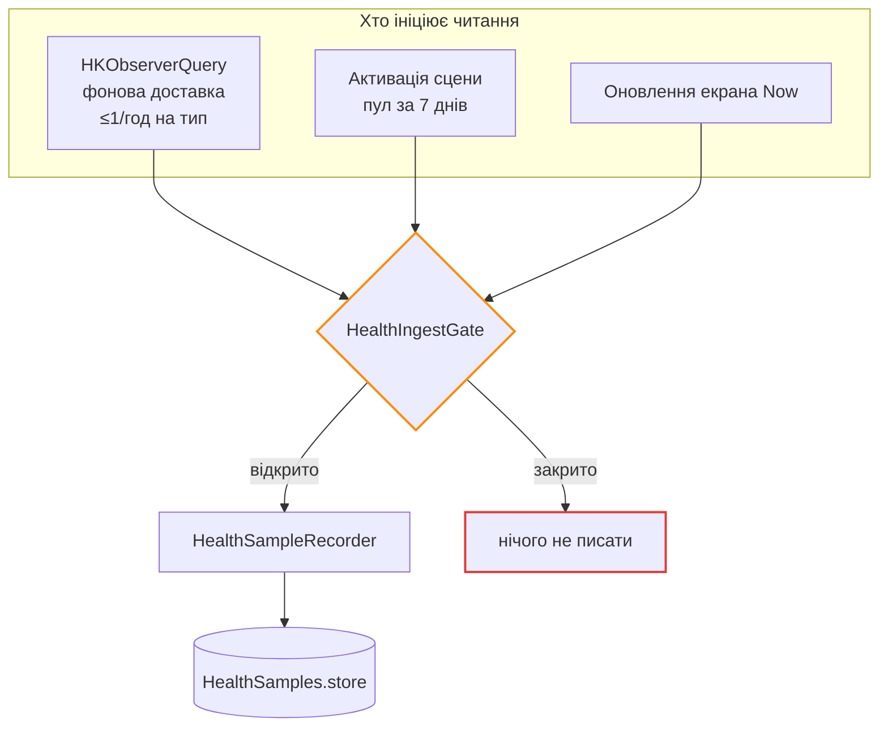

# Здоров'я

Опційні сигнали з HealthKit. **Точково**: рівно чотири типи, у кожного є споживач у
відвантаженій фічі.

## Що читається

| Тип HealthKit | Ідентифікатор | Споживач | Годує модель? |
| --- | --- | --- | --- |
| Пульс | `.heartRate` | Картка пульсу на екрані Now | **Ні** — показує зчит, який щойно зняв годинник, а не вчорашню агрегацію |
| Пульс спокою | `.restingHeartRate` | Ознаки моделі | Так |
| SpO₂ | `.oxygenSaturation` | Ознаки моделі | Так |
| Аналіз сну | `.sleepAnalysis` | Ознаки моделі + година пробудження для слота WeatherKit | Так |

Список існує в **одному** місці —
[`HealthKitReadSet`](../reference/Shared/Health/HealthKitReadSet.md) — бо в нього два
споживачі: рідер і перемикач у Налаштуваннях, який питає iOS, чи користувача вже питали
про **всі** типи. Дві копії списку розійшлися б.

```swift title="Shared/Health/HealthKitReadSet.swift"
static func sampleType(for kind: HealthMetricKind) -> HKSampleType {
    switch kind {                                     // (1)!
    case .heartRate:         HKQuantityType(HKQuantityTypeIdentifier.heartRate)
    case .restingHeartRate:  HKQuantityType(HKQuantityTypeIdentifier.restingHeartRate)
    case .oxygenSaturation:  HKQuantityType(HKQuantityTypeIdentifier.oxygenSaturation)
    case .asleep:            HKCategoryType(HKCategoryTypeIdentifier.sleepAnalysis)
    }
}
```

1.  `switch`, а не словник: нову метрику неможливо додати до словника застосунку без того,
    щоб компілятор зупинився тут і запитав, який тип HealthKit за нею стоїть.

**Запису немає.** Нічого в застосунку не пише в HealthKit, тож share-сету не існує і
користувачеві ніколи не показують перемикач запису, про який довелося б думати.

Додати п'ятий тип — це рішення з гейтом
([`healthkit_permissions`](https://github.com/s-rybak/barosense/blob/main/.claude/skills/healthkit_permissions/SKILL.md)),
а не правка файлу.

## Два шляхи запису



### Гейт інжесту

[`HealthIngestGate`](../reference/Shared/Health/HealthIngestGate.md) — актор, а не булеве
поле, і живе він на `HealthSampleRecorder` (типі, який виконує запис), а не на контролері.
Причина конкретна: екран Now оновлюється через той самий рекордер, **не проходячи через
контролер узагалі**, тож перевірка тільки в контролері лишила б шлях запису непокритим.

Гейт **закритий при створенні**. Відкривається, коли застосунок знає, що онбординг позаду
— а оскільки цей факт живе у профілі на диску, призупинення переживає перезапуск.

Історія, через яку він з'явився: «видалити мої дані» очищав лог, спостерігачі HealthKit про
це не знали, і наступне спрацювання клало той самий тиждень назад. Алерт обіцяв, що даних
немає, — а через хвилини вони були.

## Бюджет батареї (провізорний)

Тільки iPhone. **Не виміряно на пристрої**; kill switch — `HealthBackgroundDelivery.isEnabled`.

| Пункт | Значення |
| --- | --- |
| Пробудження | HealthKit, ≤1/год на спостережуваний тип (`.hourly`); 3 з 4 типів, коалесцяться, коли майже одночасні |
| Тривалість роботи | Не виміряна. Межа = один запит за 48 год + upsert у SwiftData |
| Що живиться під час пробудження | Лише запит HealthKit. Ні барометра, ні мережі, ні дисплея |
| Чому не 2 год | 2 год теж покрили б 24-годинне вікно ознаки SpO₂; погодинний ритм лишено як запас на пропущені пробудження. **Не** `.immediate` |
| Якщо пробудження ніколи не спрацює | Backstop — 7-денний пул на foreground. Конвеєр толерує пропуски |
| Витрата за добу, % | **Невідома** до Instruments на пристрої |

## Асиметрія дозволів

HealthKit **не розкриває відмову**. `authorizationStatus(for:)` для читання завжди
повертає `.notDetermined` або `.sharingDenied` у спосіб, що не відрізняє «користувач
відмовив» від «даних немає».

Тому [`HealthAccessState`](../reference/Shared/Health/HealthAccessReporting.md) і
`BarometerAccessState` — **два різні типи**, які свідомо не злиті. Барометр про свій стан
каже правду в обидва боки; HealthKit — ні. Об'єднання запросило б підпис «відмовлено» про
стан, який HealthKit ніколи не показує.

## Контекст чек-іну

Окремо від навчального логу кожен чек-ін несе **знімок**: пульс, SpO₂ і години сну, як вони
стояли на момент збереження ([`CheckInHealthContext`](../reference/Shared/Models/CheckInHealthContext.md)).

`nil` означає «знімок не брали» — рядок, записаний до появи цієї фічі, або клієнтом, який
Health не читає взагалі. Це **інший стан**, ніж знімок із трьома порожніми полями, який
означає «застосунок дивився, і в Health нічого не було». Два стани лишаються
розрізнюваними навмисно: підрахунок покриття, який їх злив би, не відрізнив би «ніколи не
питали» від «питали, нічого немає».

## Довідник

- [`HealthKitReadSet`](../reference/Shared/Health/HealthKitReadSet.md)
- [`HealthIngestGate`](../reference/Shared/Health/HealthIngestGate.md)
- [`HealthKitDataReader`](../reference/Shared/Health/HealthKitDataReader.md)
- [`HealthKitChangeObserver`](../reference/Shared/Health/HealthKitChangeObserver.md)
- [`HealthFeatures`](../reference/Shared/Features/HealthFeatures.md)
- [Приватність → HealthKit](../privacy/healthkit.md)
