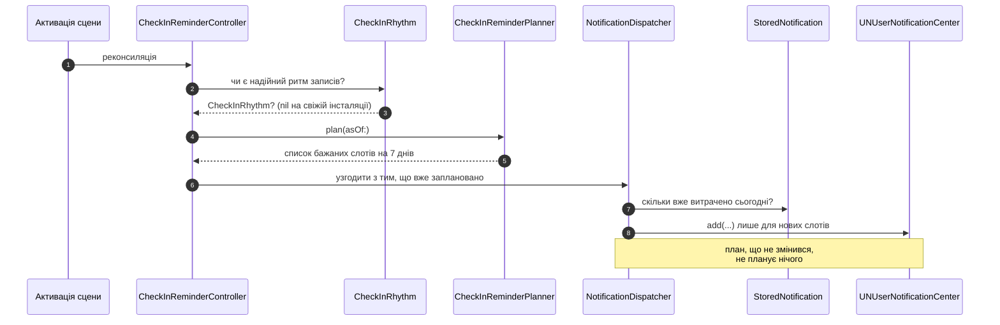

# Сповіщення

Один сценарій відвантажено: нагадування «Як ви почуваєтесь?». Випереджувальне попередження
про погоду — це те, заради чого існує модель, і воно ходить тим самим бюджетом.

## Бюджет: три на добу, на всі види разом

```swift title="Shared/Notifications/NotificationBudget.swift"
/// The shipped cap.
static let dailySendLimit = 3
```

**Три, рахуючи за локальну календарну добу, через усі види.** Не три нагадування *плюс*
три попередження: користувач переживає **сумарне** число, а ліміт «на вид» ріс би з кожним
новим видом — це і є режим відмови кожного застосунку, який зрештою нотифікує шість разів
на добу, хоча ніхто такого не вирішував.

Міркування за трійкою: нагадування варте рівно одного переривання на добу, попередження про
погоду — щонайбільше ще одного, лишається одне на добу, коли погода рухається двічі.
Четверте мусило б витіснити щось із цих трьох.

Рахунок ведеться **за збереженими рядками**, а не за тим, що надіслав цей процес, — тож він
переживає перезапуск: два сповіщення, заплановані вчора ввечері на цей ранок, уже витрачені,
коли застосунок відкривають опівдні.

Це **локальна доба користувача**, а не рухоме 24-годинне вікно. «Три на добу» — це обіцянка
прокинутись зі свіжим лімітом.

## Планування на тиждень уперед



**Нічого не працює у фоні.** Застосунок планує, коли його відкривають. План глибиною в один
слот зупинився б у той день, коли користувач не відкрив застосунок, — а це саме той день,
коли нагадування було варте відправлення.

| Параметр | Значення | Чому |
| --- | --- | --- |
| Горизонт плану | **7 днів** (`horizonDays`) | `UNUserNotificationCenter` тримає до 64 запитів на застосунок; сім — із великим запасом |
| Тригер | `UNCalendarNotificationTrigger` | Тримає і запускає системний планувальник. Застосунок **не будять** ані на спрацювання, ані щоб «підігріти» чергу |
| Kill switch | `CheckInReminderPlanner.isEnabled` | Вимкнений — план порожній, і диспетчер сам відкликає все, що лишилося |

## Бюджет батареї

**Тут не планується жодна робота самого Barosense.**

| Пункт | Значення |
| --- | --- |
| Пробудження | Немає |
| Тривалість роботи | Один прохід реконсиляції на активації, яку ініціював користувач: одне читання сховища, ≤7 крос-процесних `add`, і **нормально нуль** |
| Що живиться | Нічого. Ні сенсора, ні мережі, ні локації, ні HealthKit |
| Витрата за добу | Не вимірюється окремо — фонового виконання немає |
| Реальна вартість для користувача | **Переривання**, а не батарея. Її і обмежує `NotificationBudget` |

## Ритм чек-інів

[`CheckInRhythm`](../reference/Shared/Notifications/CheckInRhythm.md) читає, о котрій
користувач зазвичай пише. `nil` і на свіжій інсталяції, і на розкиданій історії — надійність
перевіряється явно (`isDependable`), а не припускається.

Коли ритму немає, планувальник має власне значення за замовчуванням; коли є — нагадування
підлаштовується під людину, а не навпаки.

## Журнал відправленого

[`StoredNotification`](../generated/database-schema.md#entity-storednotification) — це не
телеметрія, а **джерело бюджету**. Рядок несе вид, мову, час планування, стан і час зміни
стану.

Мова зберігається в рядку, бо текст сповіщення формується під час планування, а користувач
може перемкнути мову інтерфейсу до того, як воно спрацює.

## Формулювання

Кожен рядок тексту проходить перевірку словника
(`scripts/ci/check-copy-vocabulary.sh`). Дозволено: *відстеження*, *особисті патерни*,
*ваша історія показує*. Заборонено: *діагноз*, *передбачає ваш мігрень*, *запобігає*,
*лікує*, *медичний*.

## Довідник

- [`NotificationBudget`](../reference/Shared/Notifications/NotificationBudget.md)
- [`CheckInReminderPlanner`](../reference/Shared/Notifications/CheckInReminderPlanner.md)
- [`NotificationDispatcher`](../reference/Shared/Notifications/NotificationDispatcher.md)
- [`CheckInRhythm`](../reference/Shared/Notifications/CheckInRhythm.md)
- [`NotificationRouter`](../reference/Barosense/Notifications/NotificationRouter.md)
