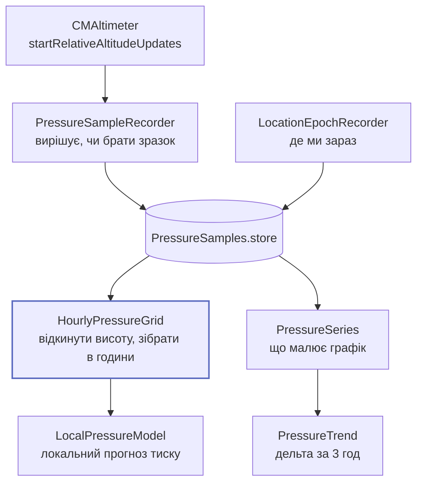

# Тиск

Найважливіша ознака моделі й основна причина, чому цей застосунок узагалі можливий:
**iPhone має справжній барометр**.

## Що робить



## Одиниці: одне перетворення, одне місце

`CMAltitudeData.pressure` приходить у **кілопаскалях** (`NSNumber`). WeatherKit і вся
метеорологія працюють у **гектопаскалях**. Змішування дає похибку в 10 разів, яку не
спіймає жоден компілятор.

```swift title="Shared/Models/Pressure.swift"
/// Builds a `Pressure` from a CoreMotion reading, which is expressed in kPa.
init(kilopascals: Double) {
    self.hectopascals = kilopascals * 10
}
```

Тому будь-який тиск, що перетинає межу модуля, несеться типом
[`Pressure`](../reference/Shared/Models/Pressure.md), а не голим `Double`.

## Частота і бюджет

| Параметр | Значення | Чому саме так |
| --- | --- | --- |
| Мінімальний інтервал | 15 хв | Обрано **під дельти**: `pressureDeltaHPaPer3h` на погодинній сітці — 3 точки, на 15-хвилинній — 12 |
| Запит до iOS на пробудження | 15 хв | `BGAppRefreshTaskRequest.earliestBeginDate` — це **підлога, не частота**. iOS вирішує сама з історії використання |
| Верхня межа | 96 зчитувань/добу | 15-хвилинна підлога обмежує обидва шляхи |
| Вартість одного зчитування | ≈1 с барометра, hard cap 5 с | Ні дисплея, ні мережі, ні локації, ні HealthKit |
| Kill switch | `PressureSamplingPolicy.isBackgroundRefreshEnabled` | Витрата **не виміряна на пристрої** |

!!! warning "Реалістична картина покриття — foreground-first"
    iOS видає `BGAppRefreshTask` за історією використання і жорстко обрізає його в
    Low Power Mode. Телефон, який беруть у руки протягом дня, покриває більшість
    15-хвилинних слотів годин неспання; фонові пробудження заповнюють, що можуть. Нічний
    пропуск реальний, і саме для чесної розповіді про нього існують ознаки
    `pressureCoverage6h` / `pressureCoverage24h`.

## Проблема висоти

Барометр міряє **тиск станції**. Він рухається, коли користувач змінює висоту: сходи,
ліфт, машина. Зміна від висоти — це не погода.

Два механізми:

### 1. Викидання екскурсій

```
зміна > 3 hPa за 10 хв  →  висота або поганий зчит, ніколи не погода
```

3 hPa за 10 хв — це 18 hPa/год. Синоптична зміна тиску не перевищує ≈2 hPa/год навіть у
циклоні, що швидко поглиблюється, — тобто поріг на два порядки вище всього, що робить
атмосфера. Значення *провізорне*: виведене з фізики темпу, не з реальних трас.

### 2. Епохи локації

[`PressureLocationEpoch`](../reference/Shared/Models/PressureLocationEpoch.md) — це
відрізок історії, протягом якого користувач був «в одному місці».

| Параметр | Значення | Обґрунтування |
| --- | --- | --- |
| Поріг нової епохи | **25 км** | Сітка WeatherKit і зсув станція→MSLP змінюються повільно на цьому масштабі: поїздка через місто нової епохи не потребує, переїзд в іншу область — потребує |
| Роздільність збереженої координати | **0,1°** ≈ 11 км | Достатньо для запиту в WeatherKit і для ключа кешу, свідомо недостатньо, щоб відновити, де людина живе |
| Горизонт зберігання | 5 років | Епоха має пережити зразки, що на неї посилаються |

Асиметрія помилок і задає порядок величини: занадто мало — кожна поїздка на роботу пише
епоху і витрачає throttled-геокодинг; занадто багато — калібратор усереднює зсуви двох
місць, а це на 500 м різниці висот ≈60 hPa нісенітниці.

## Погодинна сітка

[`HourlyPressureGrid`](../reference/Shared/Pressure/HourlyPressureGrid.md) — єдине місце,
де сирі зразки стають чимось, що може спожити фіт. Дві задачі, свідомо в цьому порядку:

1. **Відкинути екскурсії** — інакше модель вивчить «користувач пішов сходами» і
   прогнозуватиме це.
2. **Розкласти по годинах** — семплінг опортуністичний і нерегулярний за задумом, а
   лінійному фіту потрібен регулярний індекс.

**Пропуски залишаються пропусками.** Нічого не інтерполюється через дірку довшу за
дозволену політикою, бо вигадане значення нижче за течією не відрізнити від виміряного.

## Локальна модель тиску

[`LocalPressureModel`](../reference/Shared/Pressure/LocalPressureModel.md) — окремий від
ризику фіт, який прогнозує сам тиск.

| Показник | Значення |
| --- | --- |
| Частота перенавчання | не частіше **1×/добу** (`refitIntervalSeconds`) |
| Виміряна тривалість | **16,6 мс** на повний 30-денний рефіт (720 погодинних комірок, ~716 рядків дизайну, 7 параметрів), Debug-збірка в симуляторі |
| Арифметика | ~35 000 множень-додавань на `XᵀX` + ~230 на розв'язок 7×7 |
| Засіб пробудження | **немає** — рефіт іде всередині foreground-активації, яку ініціював користувач |
| Що станеться, якщо рефіт не запуститься | Використовуються вчорашні коефіцієнти. Втрачається точність, не коректність |

## Зберігання

5 років. ~2 900 рядків на місяць при 1 рядку/15 хв → ~175 000 рядків на горизонті, десятки
МБ з індексом по часу. Це **стеля, а не ціль**: горизонт існує, щоб файл не ріс
необмежено, а не тому, що шостий рік був би дорогим.

Прибирання не має власного таймера: перевірка горизонту відбувається після вдалого
зчитування, не частіше ніж раз на добу.

## Що ламається, якщо підсистема не працює

| Збій | Наслідок |
| --- | --- |
| Немає барометра (симулятор, iPad) | `BarometerAccessState.unavailable` — контрол інертний, а не просто вимкнений |
| Motion & Fitness відмовлено | `.denied`. Виправляє тільки iOS Settings: промпт видається раз на інсталяцію |
| Фонове пробудження не спрацьовує | Foreground-активація — backstop. Ознаки покриття чесно повідомляють про пропуски |
| Сховище не відкрилося | Рядок метрик працює на in-memory дублері; історія не переживе цього запуску |

## Довідник

- [`PressureSampleRecorder`](../reference/Shared/Pressure/PressureSampleRecorder.md)
- [`HourlyPressureGrid`](../reference/Shared/Pressure/HourlyPressureGrid.md)
- [`LocationEpochResolver`](../reference/Shared/Pressure/LocationEpochResolver.md)
- [`LocalPressureModel`](../reference/Shared/Pressure/LocalPressureModel.md)
- [`PressureSeries`](../reference/Shared/Pressure/PressureSeries.md)
