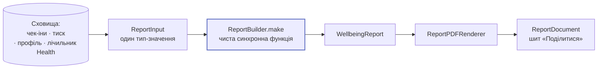

# Звіти

PDF за період — єдина частина застосунку, яку читає **інша людина**. Найчастіше — лікар.

## Конвеєр

[`ReportBuilder`](../reference/Shared/Report/ReportBuilder.md) — **чистий, синхронний і
вільний від усіх залежностей застосунку**: без сховища, без власного годинника, без в'ю. Це
не естетика: документ читає стороння людина, тож те, що в нього потрапляє, має перевірятися
тестом із десятком літералів, а не генерацією PDF і розгляданням його очима.

Кожна функція приймає `Calendar`, у якому має працювати. Межі доби вирішують, який запис
потрапить на який рядок графіка, і білдер, що сам тягнеться до `.current`, проходив би в
одному часовому поясі й падав в іншому.

## `ReportInput` — один тип замість п'яти параметрів

П'ять позиційних значень чотирьох різних форм — це п'ять шансів передати їх у неправильному
порядку, і лише два (масиви) спіймав би компілятор.

| Поле | Що це |
| --- | --- |
| `profile` | `UserProfile?` — шапка документа |
| `checkIns` | Чек-іни вікна, як їх повернуло сховище |
| `pressureSamples` | Зразки тиску того ж вікна |
| `healthReadingCount` | **Число**, а не самі зразки: документ друкує, скільки даних Health підпирало період, і нічого більше про них |

Усе за межами вікна білдер відфільтрує сам, тож викликач, який прочитав трохи ширший
діапазон, не псує підсумків.

## Що в документі є і чого немає

| Є | Немає |
| --- | --- |
| Профіль (те, що користувач сам заповнив) | Будь-яке твердження про діагноз, лікування чи запобігання |
| Розподіл інтенсивності 1–10 | Вихід моделі, поданий як факт |
| Найчастіші теги за період | Сирі координати або назви місць |
| Слід «денний тиск ↔ найгірший чек-ін доби» | Вільний текст `note` |
| Скільки читань Health підпирало період | Сирі рядки HealthKit |

Формулювання документа — та сама перевірка словника, що й для інтерфейсу
(`scripts/ci/check-copy-vocabulary.sh`). Це найризикованіша поверхня з погляду медичних
тверджень саме тому, що її читає лікар: документ, який виглядає як медичний висновок, і є
та причина, з якої відхиляють за Guideline 1.4.1.

## Періоди

[`ReportPeriod`](../reference/Shared/Report/ReportPeriod.md) — перелік доступних вікон.
Гейтовано підпискою (`PremiumFeature.report`).

## Довідник

- [`ReportBuilder`](../reference/Shared/Report/ReportBuilder.md)
- [`WellbeingReport`](../reference/Shared/Report/WellbeingReport.md)
- [`ReportPeriod`](../reference/Shared/Report/ReportPeriod.md)
- [`ReportPDFRenderer`](../reference/Barosense/Screens/Settings/Report/ReportPDFRenderer.md)
- [`ReportModel`](../reference/Barosense/Screens/Settings/Report/ReportModel.md)
