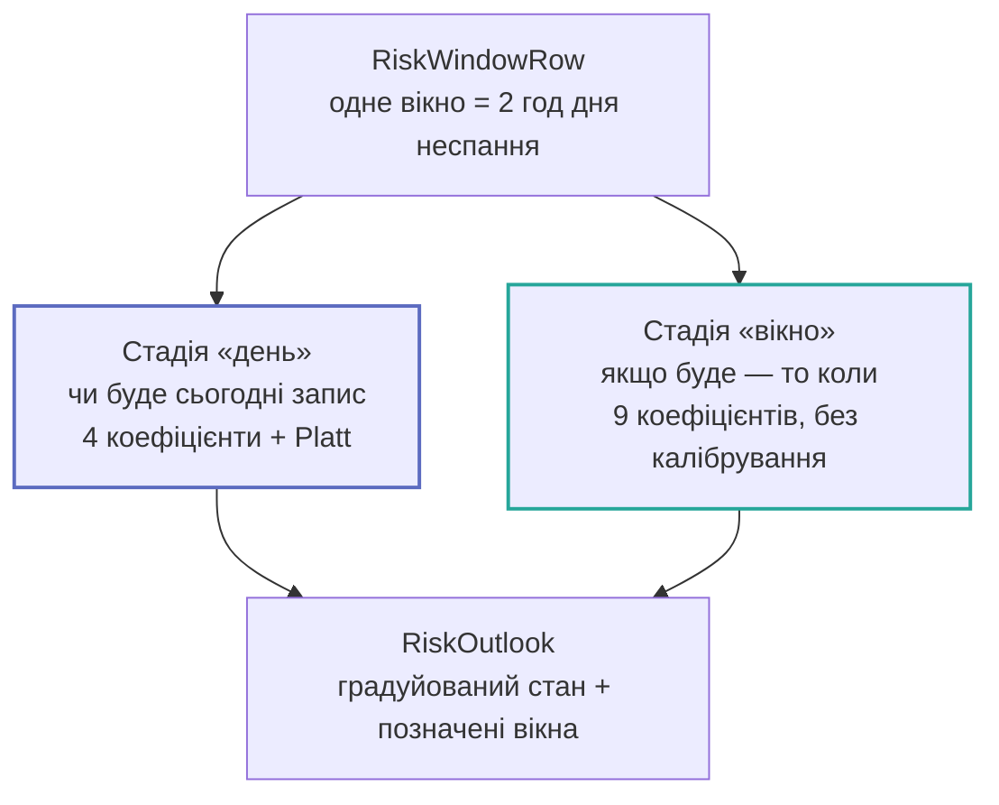
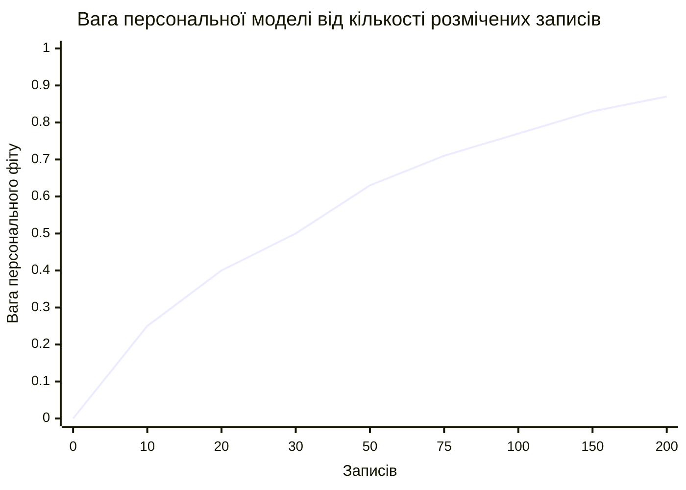

# Ризик і прогноз

Головна цінність продукту й найскладніша його частина. Тут — інженерний бік; статистика і
метрики — у розділі [ML](../ml/index.md).

## Дві стадії, а не одна

Одна модель над вікнами відповідає на обидва питання одразу — і на жодне добре. Доказ у
самих ознаках: денні колонки **сталі всередині доби**, тож не можуть ранжувати одне вікно
вище за інше.

| Набір ознак | hit@1 | ROC-AUC |
| --- | --- | --- |
| Лише віконні ознаки | **0,43** | — |
| Лише денні ознаки | 0,11 | 0,535 — це монетка |

Якщо фітити їх разом, сильний денний сигнал однаково піднімає **всі** вікна доби і читається
як упевненість щодо «коли».

Калібрування має тільки денна стадія: віконна використовується **лише для ранжування**, і
ніщо не порівнює її вихід із фіксованим числом.

## Геометрія вікон

| Параметр | Значення | Обґрунтування |
| --- | --- | --- |
| Ширина вікна | **120 хв** | Чек-ін буває щонайбільше раз на добу проти 96 чвертей години неспання — 0,8% позитивного класу на ~90 подіях, що не вивчається. На двох годинах це ~11% від дев'яти вікон |
| Початок дня | **5-й перцентиль** годин записів користувача | Не мінімум: мінімум — оцінювач по одному спостереженню, і один запис о 00:30 перетворив би дев'ятивіконну добу на дванадцятивіконну, зсунувши базову частоту |
| Значення за замовчуванням | **06:00** | *Провізорне.* Значення, яке дала синтетична 120-денна траса (найраніший запис 07:00 мінус година запасу) |
| Мінімум записів для власного початку | **3** | Один ранній запис — це анекдот |

Ніч вирізана як **обмеження домену**, а не як ознака. До пробудження користувач фізично не
може зробити запис, і вікно там має відому відповідь — включити його означало б подарувати
моделі безкоштовну точність на годинах, коли ніхто не спав.

## Cold start: популяційний пріор

Обмеження №5 в `CLAUDE.md`: модель має давати корисний вихід із 3–7 днями історії.

Формула — `w(n) = n / (n + 30)`, де константа `priorBlendConstant = 30`. На 30 записах
персональний фіт і пріор важать порівну.

!!! danger "Що таке пріор насправді"
    Це **не популяція**. Це одна синтетична людина зі 120-денної траси дослідницького
    ноутбука (89 самозвітів), а генератор цієї траси написаний із **явно закладеним
    барометричним ефектом**: падіння на 10 hPa за шість годин робить слот приблизно в три
    тисячі разів імовірнішим для запису.

    Наслідки, які не обговорюються:

    1. Власна базова частота пріора — **0,75 доби із записом**. Користувач, який пише двічі
       на тиждень, буде переоцінений, поки його власний фіт не візьме гору.
    2. Жодне число з цього файлу **не може бути показане на екрані як виміряна точність**.

Мінімум для власного фіту — `WellbeingRiskTrainer.minimumTrainingDays = 7` днів.

## Бюджет батареї

**Власного засобу пробудження немає.** Обидва шляхи їдуть на роботі, яку застосунок і так
робив: foreground-активація, або наявне фонове завдання барометра, що приносить зчит і
перезавантажує графік.

| Параметр | Значення |
| --- | --- |
| Перенавчання | не частіше **1×/добу** (`refitIntervalSeconds`) |
| Мемоізація прогнозу | **15 хв** (`forecastCacheSeconds`) — це підлога семплінгу барометра: нижче за неї не може з'явитися новий зчит |
| Горизонт прогнозу | **96 год** — рівно стільки, скільки найширша кнопка графіка малює кривої WeatherKit |
| Арифметика фіту | Newton на системі 10×10 над ≤~1 000 рядків ≈ **10⁵** множень-додавань |
| Виміряно на пристрої | **Ні.** Порядок оцінено відносно `LocalPressureModel` (16,6 мс). Виміряти Instruments, перш ніж цитувати як факт |
| Kill switch | `WellbeingRiskEngine.isEnabled` |

Денний throttle прив'язаний **лише** до `lastFitAt`. Прив'язаний ще й до «модель існує»,
він провалювався на кожному пристрої з історією менше `minimumTrainingDays` — тобто в
стані, з якого починається і в якому найдовше живе кожна нова інсталяція, — і той
перечитував 120 днів зразків і чек-інів кожні 15 хвилин.

## Що показує екран

**Ніколи не «так/ні» і ніколи не відсоток, поданий як факт.** На екран іде градуйований
стан [`RiskOutlook`](../reference/Shared/Risk/RiskOutlook.md).

Формулювання теж не довільні: рядок графіка читається як «сьогодні ймовірний чек-ін», а не
«попереду важчий день». Це вимога
[`appstore_compliance`](https://github.com/s-rybak/barosense/blob/main/.claude/skills/appstore_compliance/SKILL.md),
і вона випливає з того, **яка саме мітка** тут прогнозується — див.
[Мітки](../ml/labels.md).

## Що ламається

| Збій | Наслідок |
| --- | --- |
| Менше 7 днів історії | Персонального фіту немає; показується пріор із чесною позначкою «даних ще мало» |
| Пріор вимкнено і фіту немає | Прогноз не показується взагалі |
| `isEnabled = false` | Кожна поверхня малюється рівно так, як до появи підсистеми |
| Нуль позитивних міток у фолді | Метрики деградують контрольовано, а не діляться на нуль (це окрема фікстура в тестах) |

## Довідник

- [`WellbeingRiskEngine`](../reference/Shared/Risk/WellbeingRiskEngine.md)
- [`WellbeingRiskModel`](../reference/Shared/Risk/WellbeingRiskModel.md)
- [`WellbeingRiskTrainer`](../reference/Shared/Risk/WellbeingRiskTrainer.md)
- [`WellbeingRiskPrior`](../reference/Shared/Risk/WellbeingRiskPrior.md)
- [`RiskWindowGeometry`](../reference/Shared/Risk/RiskWindowGeometry.md)
- [`PlattCalibration`](../reference/Shared/Risk/PlattCalibration.md)
- [`RiskBaselines`](../reference/Shared/Risk/RiskBaselines.md)
