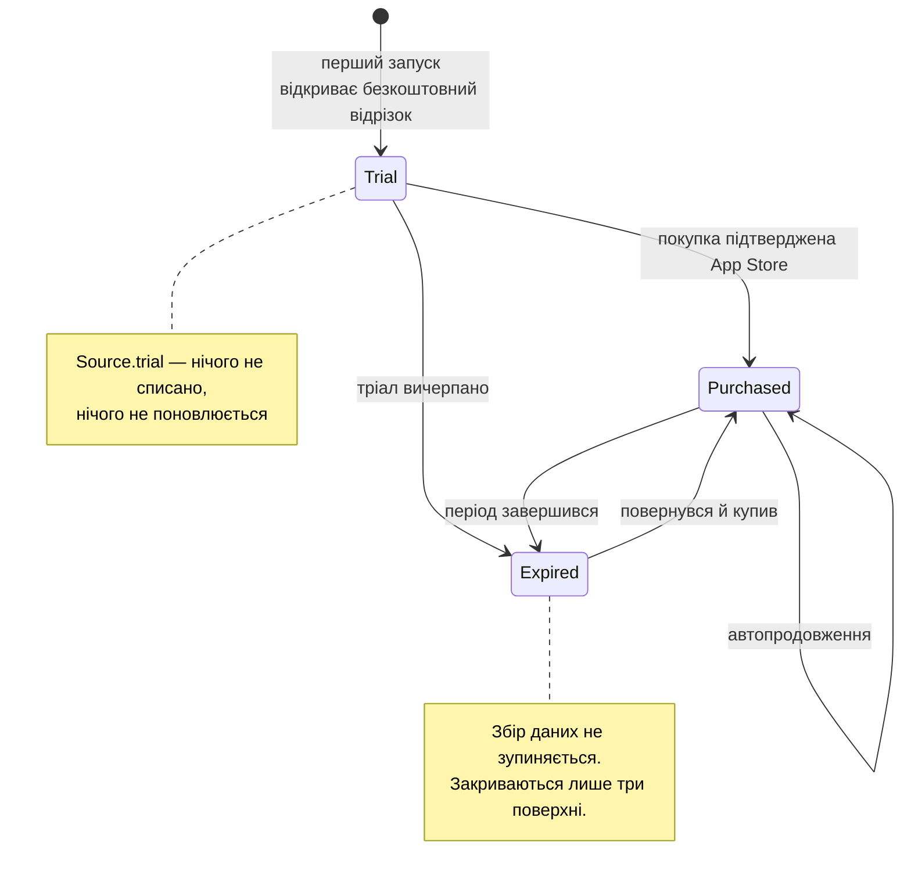

# Підписка

## Що закрито, а що ні

Гейтованих поверхонь **три**:

| Фіча | Що це | Чому саме вона |
| --- | --- | --- |
| `report` | PDF-звіт, яким можна поділитися | Найчастіше запитувана окрема річ і та, у якої очевидна цінність за використання — це якір платного рівня |
| `insights` | Екран Insights | Патерни за 120 днів |
| `riskOutlook` | Картка прогнозу вгорі Now | Форвардне прочитання власної історії користувача |

!!! success "Що навмисно лишається відкритим — більша половина застосунку"
    Чек-іни, словник тегів, графік тиску (включно з половиною від WeatherKit), History,
    рядки здоров'я, нагадування і годинник **працюють на протермінованій інсталяції**.

    Це не щедрість. Обмеження №5 в `CLAUDE.md` робить персональну модель безвартісною без
    безперервної історії, і застосунок, який припиняє **записувати**, коли підписка
    закінчилась, викидає саме те, за що платив би повернений підписник.

    **Пейвол закриває те, що застосунок показує, і ніколи те, що він збирає.**

Графік під карткою ризику лишається відкритим свідомо: це погода, а не персональне
прочитання.

## Модель стану



[`SubscriptionStatus`](../reference/Shared/Subscription/SubscriptionStatus.md) — це тип-значення
з датами, а не голий прапорець `isPremium`, бо кожен екран, що це показує, має відповісти й
на питання «до якого числа»: картка в Налаштуваннях друкує дату, а гейт має переоцінитися,
коли годинник перетне межу, без жодного повторного запиту.

**Годинник — завжди параметр, ніколи `Date()` всередині.** Кожне питання до цього типу
приймає `asOf:`, тож тест може провести інсталяцію через кінець тріалу без `sleep`, а два
в'ю, відрендерені в одному кадрі, не можуть розійтися в тому, з якого боку межі вони.

## Гейт

```swift title="Shared/Subscription/PremiumFeature.swift"
/// Whether `feature` may be drawn at `instant`.
static func isUnlocked(_ feature: PremiumFeature, …)
```

Вільна функція над типом-значенням, а не метод контролера: правило має бути досяжним із
юніт-тесту із синтетичним годинником, без сховища, без StoreKit і без в'ю.

Усі гейтовані фічі відкриваються і закриваються **разом** — це одна покупка. Таблиця «фіча →
правило» була б абстракцією для другого випадку, якого не існує; той день, коли він
з'явиться, змінить рівно цю функцію.

## Зберігання

`StoredSubscription` живе в `Barosense.store` разом із профілем — і **не** тому, що на щось
там посилається. Причина інша: окремий контейнер був би четвертим файлом SQLite, який може
не відкритися на запуску, а це заблокувало б платного користувача поза тим, що він купив.

Кожне поле опціональне, тож приєднання таблиці до наявного контейнера — полегшена міграція:
наявна інсталяція отримує порожню таблицю, а не потребу в маппінгу.

## Довідник

- [`PremiumFeature` / `SubscriptionGate`](../reference/Shared/Subscription/PremiumFeature.md)
- [`SubscriptionStatus`](../reference/Shared/Subscription/SubscriptionStatus.md)
- [`SubscriptionPlan`](../reference/Shared/Subscription/SubscriptionPlan.md)
- [`SubscriptionController`](../reference/Barosense/Subscription/SubscriptionController.md)
- [`StoreKitSubscriptionPurchaser`](../reference/Barosense/Subscription/StoreKitSubscriptionPurchaser.md)
