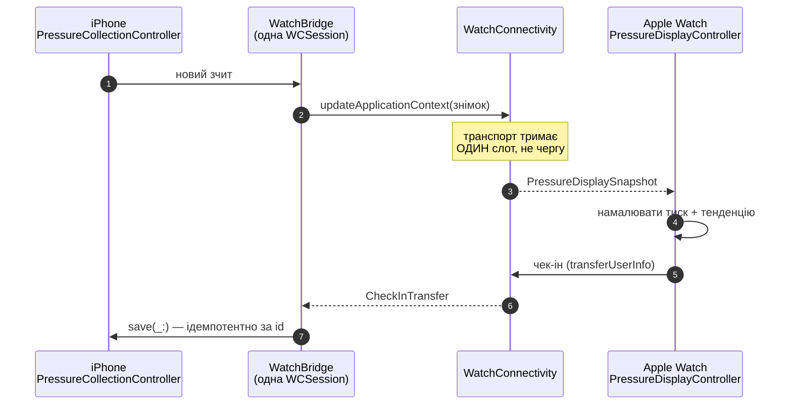

# Apple Watch

Годинник у цьому застосунку — **тонкий клієнт**. Він не має власного барометра, не веде
свого сховища тиску і не планує фонових оновлень.

## Чому годинник не семплить, хоча має барометр

Обидва пристрої мають барометр, і використання обох виглядає як безкоштовне покриття. Воно
не безкоштовне: **два пристрої на двох висотах, що пишуть в один ряд, виробляють рівно ту
контамінацію**, проти якої існує весь механізм епох і викидання екскурсій. А в рядку
`PressureSample` немає нічого, що сказало б, який пристрій його зробив.

Один сенсор, один ряд.

Який саме — це реальний компроміс:

| | Годинник | Телефон |
| --- | --- | --- |
| Де він фізично | На зап'ясті — міряє там, де людина справді є | Може лежати на столі, поки людина надворі |
| Як часто беруть у руки | — | Десятки разів на добу |
| Живлення | Бюджетується погодинно | Заряджається щоночі |
| Шлях до навчального логу | Через радіо-хоп, який може застрягти | Прямо у сховище |

Телефон виграє на всьому, крім першого рядка. Годинник зберігає роль: він **показує**
найсвіжіший зчит телефона і є місцем, де чек-іни зручно робити.

Зміна, яка зробила б семплінг на обох безпечним, — додати провенанс пристрою і
пер-девайсний висотний референс. Її **не зроблено**.

## Що передається

### Знімок для показу

[`PressureDisplaySnapshot`](../reference/Shared/Pressure/PressureDisplayLink.md) — один
плаский payload: поточний тиск, дельта за 3 год, час зчитування, коротка серія для
спарклайна.

### Словник тегів

Телефон **володіє** словником: користувач додає, перейменовує і архівує теги. Тому годинник
не може тримати власну копію `WellbeingTag.seeds` і лишатися правим — йому надсилають те,
що зараз активне.

| Параметр | Значення | Чому |
| --- | --- | --- |
| `WatchTag.maxOffered` | **12** | Екран 40 мм вміщує близько шести чіпів, перш ніж список перестає бути поглядом і стає скролом. Дванадцять — два екрани |
| Порядок | Seeded у порядку оголошення, потім користувацькі за абеткою | Той самий порядок, що й у формі на телефоні: хто тягнеться до третього чіпа на телефоні, має знайти той самий тег на тому самому місці |
| `isArchived` | **Не передається** | Архівований тег ніколи не надсилають, а поле, яке завжди `false` на дроті, колись прочитають навпаки |

Переповнення не втрачається — воно просто не на годиннику: власна форма телефона пропонує
весь словник.

### Чек-ін із годинника

[`CheckInTransfer`](../reference/Shared/Watch/CheckInTransfer.md). Ключова властивість —
**ідемпотентність**: `CheckInStore.save(_:)` замінює рядок із тим самим `id`, тож payload,
доставлений двічі, не стає двома навчальними рядками.

## Бюджет батареї watchOS

**Нічого бюджетувати.** Watch-таргет:

- не стартує жодного сенсора;
- не планує фонового оновлення;
- не відкриває сховища тиску;
- тримає одну `WCSession`.

Реакція — щонайбільше одна доставка контексту на один зчит телефона. Транспорт тримає
**один слот, а не чергу**: годинник, що шість годин пролежав знятим, отримає на наступному
пробудженні **один** контекст, а не двадцять чотири.

## Дозволи на годиннику

`NSMotionUsageDescription` у watch-таргеті **немає** — і це навмисно. Purpose string для
дозволу, якого ніхто не запитує, — це промпт, на який користувача просять відповісти заради
неіснуючої фічі. Це те саме правило точкових дозволів із `CLAUDE.md`, застосоване до Motion,
а не до HealthKit.

`NSHealthShareUsageDescription` є — годинник читає ті самі чотири типи для показу.

## Ускладнення (complication)

Ускладнення на циферблаті — заявлена ключова точка взаємодії продукту. Умова читабельності:
**одне число або один стан, розбірливий за ≈0,5 с**, без щільного тексту.

!!! note "Статус"
    Актуальний стан «відвантажено / заплановано» для кожної підсистеми ведеться в таблиці
    Status у [`ml-spec.md`](https://github.com/s-rybak/barosense/blob/main/.claude/context/ml-spec.md),
    а не тут — щоб не було двох джерел правди.

## Довідник

- [`WatchBridge`](../reference/Barosense/Watch/WatchBridge.md)
- [`WatchConnectivityPressureLink`](../reference/Shared/Pressure/WatchConnectivityPressureLink.md)
- [`WatchContext`](../reference/Shared/Watch/WatchContext.md)
- [`CheckInTransfer`](../reference/Shared/Watch/CheckInTransfer.md)
- [`PressureDisplayController`](../reference/BarosenseWatch/PressureDisplayController.md)
