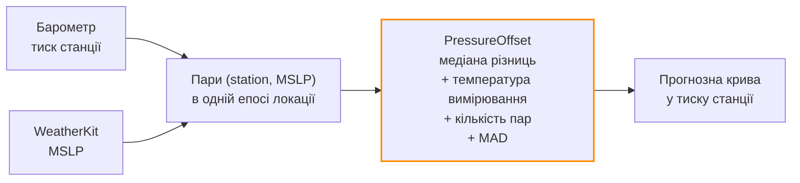

# Погода

Барометр знає, що **зараз**. WeatherKit знає, що буде **далі**. Саме друге робить
можливим _випереджувальне_ сповіщення, а не констатацію факту.

## Бюджет запитів

```mermaid
gantt
    title Слоти WeatherKit протягом доби
    dateFormat HH:mm
    axisFormat %H:%M
    section Слоти
    Перший слот — година пробудження :done, s1, 07:00, 30m
    Слот 12:00                        :done, s2, 12:00, 30m
    Слот 16:00                        :done, s3, 16:00, 30m
    Слот 20:00                        :done, s4, 20:00, 30m
```

[`WeatherRequestBudget`](../reference/Shared/Weather/WeatherRequestBudget.md) дозволяє
запит у **чотири моменти на добу** — 08/12/16/20, причому перший зсувається на годину
пробудження користувача, взяту з `.sleepAnalysis`. Яке б виконання застосунок не отримав
наступним — воно витрачає слот, що настав.

**Власного засобу пробудження немає.** Запити їдуть на вже наявному `BGAppRefreshTask`
барометра і на foreground-активаціях.

### Квота

| Показник | Значення |
| --- | --- |
| На пристрій | 4/добу = **120/місяць** |
| Ліміт Apple Developer Program | 500 000/місяць на **членство**, не на застосунок |
| Пристроїв до вичерпання | ≈ **4 160**, на практиці більше — невитрачені слоти не витрачаються |
| Bootstrap | Один додатковий історичний запит на інсталяцію для калібрування зсуву → у перший день може бути 5 викликів |

!!! danger "Невдалий запит теж витрачає слот"
    Бюджет рахує **збережені видачі**. Раніше невдача лишала архів порожнім, а слот —
    невитраченим, і сервіс, що відмовляє збірці (порожній `DEVELOPMENT_TEAM`, протермінований
    токен, день без мережі), перетворював кожну активацію сцени на новий виклик. Тепер
    невдачі записуються в той самий деннийжурнал (`WeatherKitPreferenceStore.recordFailedRequest(at:)`).
    Лише невдачі — бо запит, який дійшов, пише рядки, і ці рядки і є записом.

## Калібрування зсуву: station → MSLP

WeatherKit віддає тиск, зведений до рівня моря. Барометр міряє тиск станції. Це різні
числа, і різниця **не стала**.



Apple зводить тиск «за спостережуваними умовами», тому зсув рухається з температурою. Тому
[`PressureOffset`](../reference/Shared/Weather/PressureOffsetCalibrator.md) зберігає не
одне число, а чотири:

| Поле | Що це | Навіщо |
| --- | --- | --- |
| `offsetHPa` | `station − MSLP` у hPa | Навколо Києва (≈180 м) ≈ **−22**. Від'ємний скрізь вище рівня моря |
| `referenceTemperatureC` | Температура вимірювання | Якір, навколо якого повертається корекція |
| `pairCount` | Скільки пар пішло в медіану | Зсув із шести пар і зі двохсот — різні твердження, і смуга на прогнозі має право це сказати |
| Половина розкиду (MAD) | Внесок зсуву у смугу прогнозу | Медіанне абсолютне відхилення, а не SD — одна екскурсія по висоті інакше розширила б смугу |

## Горизонт і зберігання

| Параметр | Значення |
| --- | --- |
| Скільки годин уперед просить графік | **96 год** (`PressureChartRange.widest`) — стільки ж просить і ризик-модель |
| Максимальний вік видачі | 12 год (`WeatherForecastPolicy.maximumIssueAgeSeconds`) — крива дістає на 240 год уперед, тож вона ще валідна |
| Сирі рядки зберігаються | **90 днів** |
| Обсяг на горизонті | 4 запити/добу × ~240 погодинних точок × 90 днів ≈ **86 000 рядків** |
| Похідні ознаки | Зберігаються безстроково — чотири float на добу |

## Атрибуція Apple

WeatherKit вимагає видимої атрибуції з посиланням на юридичне повідомлення. Це
[`AppleWeatherAttribution`](../reference/Barosense/Weather/AppleWeatherAttribution.md) на
iOS і [`WeatherKitAttributionProvider`](../reference/Shared/Weather/WeatherKitAttributionProvider.md)
у `Shared/`. Відсутність атрибуції — підстава для відхилення на ревʼю.

## Що ламається

| Збій | Наслідок |
| --- | --- |
| Немає дозволу на локацію | Прогноз недоступний; графік малює лише минуле з барометра |
| WeatherKit повертає 401 | Проблема на боці акаунта/entitlement, а не коду. Слот усе одно витрачається — див. вище |
| День без мережі | Крива віком до 12 год лишається валідною; далі forward-половина графіка зникає |
| Калібрування ще не набрало пар | Прогнозна крива не показується в тиску станції — смуга ширша, і це видно |

## Довідник

- [`WeatherRequestBudget`](../reference/Shared/Weather/WeatherRequestBudget.md)
- [`WeatherKitForecastProvider`](../reference/Shared/Weather/WeatherKitForecastProvider.md)
- [`PressureOffsetCalibrator`](../reference/Shared/Weather/PressureOffsetCalibrator.md)
- [`PressureForecastReader`](../reference/Shared/Weather/PressureForecastReader.md)
- [`WeatherForecastRefresher`](../reference/Shared/Weather/WeatherForecastRefresher.md)
